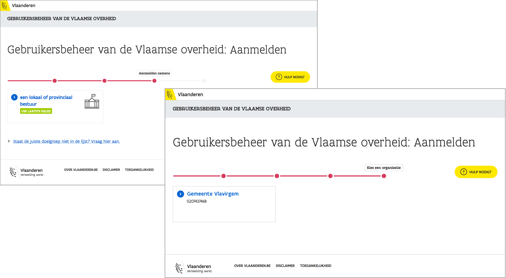
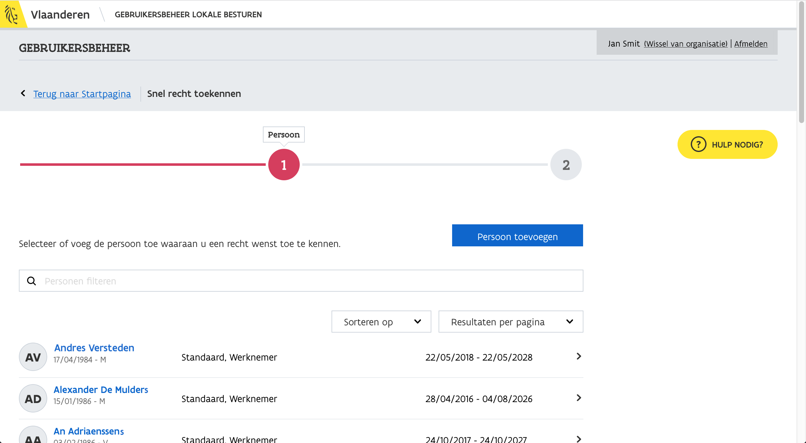
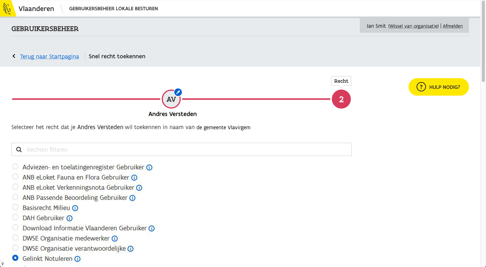

# Access Products and Services Via Gebruikersbeheer Vlaanderen


**To access most of ABB's applications**, you must have been granted the necessary access rights through user and access management.


Access rights are granted by the **local administrator** who is on each board. Usually this is the secretary/general manager, clerk or someone designated by the organization. So it is best to check with them if you do not know who your local administrator is.

.png>)

## **Log in**

To assign rights to users as a local administrator, visit [**https://vo-gebruikersbeheer.vlaanderen.be**](https://vo-gebruikersbeheer.vlaanderen.be). Learn more at [https://overheid.vlaanderen.be/ict/ict-diensten/gebruikersbeheer](https://overheid.vlaanderen.be/ict/ict-diensten/gebruikersbeheer).

Sign in using your preferred sign-in system:

Next, **choose the appropriate target audience**, and the board you want to apply to.

Click "**snel rechten toekennen**" to start.

## Looking for the Right Person

You will see an overview, where you can search for the right person.

## Looking for the Correct Rights

Then you can look for the appropriate entitlements for the selected person. Depending on the application you choose, it will be a different right.

.png>)

### Overview Rights Per Application

* Gelinkt Notuleren: **choose Gelinkt Notuleren**
* Loket Lokaal Bestuur: **choose Loket voor Lokale Besturen**
* Organisatieportaal: **choose ABB OrganisatiePortaal Gebruiker**

#### Example "Gelinkt Notuleren".

#### Example looking for "Loket voor Lokale Besturen"

## Assigning Roles or Contexts

Depending on the application you chose, you can now assign [roles](./#assigning-roles) or [contexts](./#assigning-contexts) to the person you granted access to.

### Assigning Roles

You can give a user the right to perform or not perform certain actions based on roles. A user can be given rights for multiple roles.

#### Example of 4 roles for Gelinkt Notuleren:

* Lezer (reader)
* Ondertekenaar (signature authority)
* Publiceerder (publisher)
* Schrijver (writer)

#### Example of roles for Organisatieportaal:

* Beheerder (administrator)
* Editeerder (editor)
* Lezer (reader)

### Assigning Contexts

You can grant or deny a user access to certain parts of the application using contexts.

Once a user has access to a particular context, this user can perform all actions for the associated components. A user can be granted rights to multiple contexts.

Voorbeeld van 7 contexten voor Loket Lokaal Bestuur:

* Context Gebruiker Mijn Toezicht: recht op onderdeel toezicht.
* Context Gebruiker Berichtencentrum: recht op onderdeel berichtencentrum.
* Context Gebruiker BBC DR: recht op onderdeel BBC-DR.
* Context Gebruiker Mandatenbeheer: recht op onderdeel mandatenbeheer.
* Context Gebruiker Leidinggevendenbeheer: recht op onderdeel leidinggevendenbeheer.
* Context Gebruiker Personeelsbeheer: recht op onderdeel personeelsbeheer.
* Context Gebruiker Subsidies: recht op onderdeel subsidiebeheer.

## Giving a reason

Also provide a reason for granting the right.

## Complete the Process

You will be asked to confirm the assignment of permissions, after which a message will appear if the process was completed successfully.

The person can now[ sign in](signing-in.md) with the assigned roles or contexts for the chosen application.
