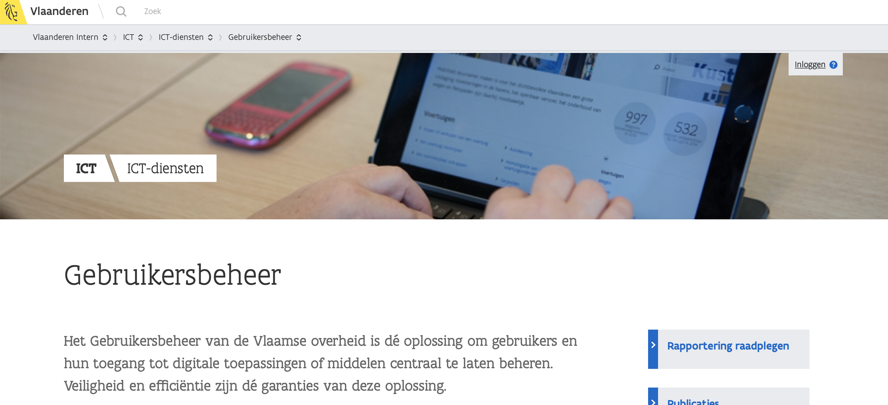
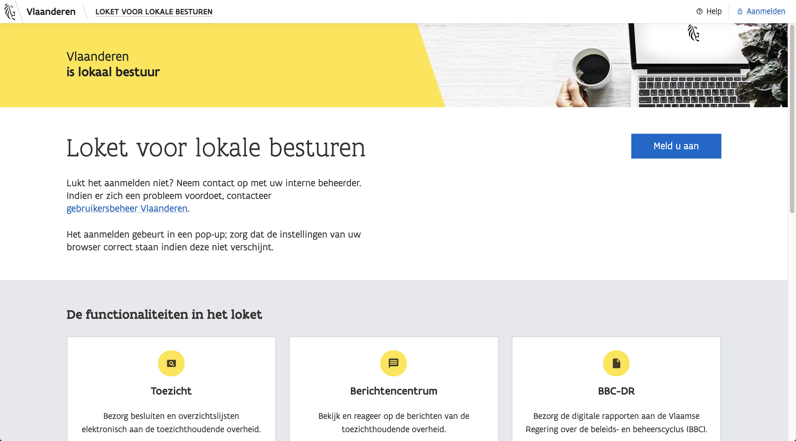
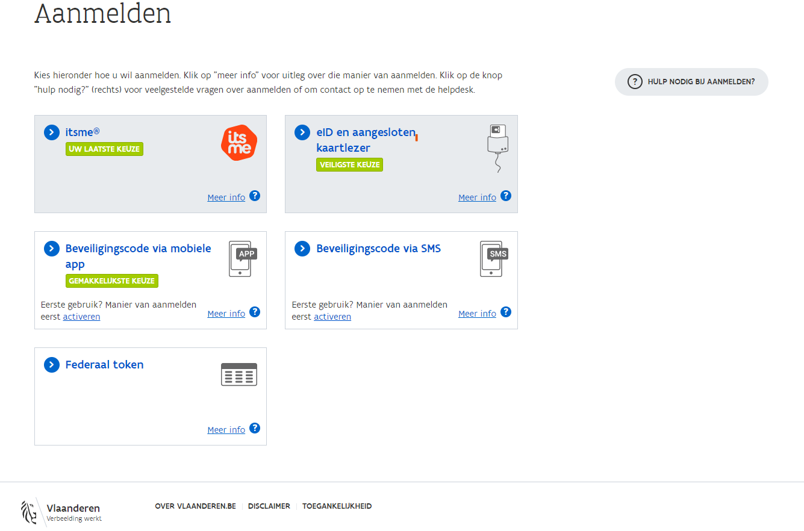

# Signing in

## Browser choice: Firefox of Chrome

To take full advantage of our applications, please use [**Firefox**](https://www.mozilla.org/nl/firefox/new/) **or** [**Chrome**](https://www.google.com/chrome/).


However, it is possible that certain functionalities do not work as they should. Should you notice this, you can always let us know via: [DigitaalABB@vlaanderen.be](mailto:DigitaalABB@vlaanderen.be).


## Making Sure You Are Known as a User to the Flemish Government


Our applications are provided for you to sign in securely through [Gebruikersbeheer Vlaanderen](./).


To access our applications, you must be known as a user in Gebruikersbeheer Vlaanderen.

The **local administrator** who is on each board can give you access to this. Usually this is the secretary/general manager, clerk or someone designated by the organization. So it's best to check with them if you don't know who your local administrator is. [More information about user management.](./)

## Signing in via the Landing Page

Signing up is done through the familiar user management Flanders.

All of our applications have a blue button with "Sign Up" on their landing page. Click on this button to continue. View all web applications of the Domestic Administration Agency.

## Pop-up

A pop-up will then appear, presenting you with some secure options to sign in with.

### Choosing an Administrative Unit

If you have access to administrative units, the pop-up will give you the option to choose one.

### In Case the Pop-Up Does Not Appear

Make sure your browser settings are correct.

* **Firefox**\
  Visit this link [https://support.mozilla.org/en-US/kb/pop-blocker-settings-exceptions-troubleshooting#w\_pop-up-blocker-settings](https://support.mozilla.org/en-US/kb/pop-blocker-settings-exceptions-troubleshooting#w\_pop-up-blocker-settings) and choose Pop-up blocker settings.
* **Chrome**\
  Visit this link [https://support.google.com/chrome/answer/95472?co=GENIE.Platform%3DDesktop\&hl=en](https://support.google.com/chrome/answer/95472?co=GENIE.Platform%3DDesktop\&hl=en).


Not getting access to the application? Go to [Gebruikersbeheer Vlaanderen](../toegankelijk-vlaanderen.md) for more information.


## Logged in.

After choosing an administrative unit, you are logged in. You will now have access to the modules you are known for in [Gebruikersbeheer](./).

