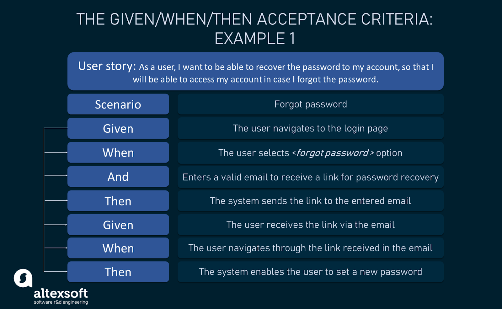

# Acceptance Criteria

## Why do we need acceptance criteria?

Acceptance criteria help to form a boundary that assists product team members to understand what is included and what is excluded from the scope of a particular product feature (epic) or a user story that belongs to an epic.

## What are good acceptance criteria?

1\. An acceptance criterion should always be written from a user’s perspective. It should be written anytime before the epic or user story is assumed as ready to enter the sprint planning.&#x20;

2\. Each acceptance criterion must be independently testable and thus have a clear pass or fail scenarios.

3\. Acceptance criteria should entail both functional and non-functional criteria.

4\. Acceptanc criteria can be formulated as check list items (rule oriented) or using Given/When/Then (scenario oriented)&#x20;

## Acceptance criteria for epics

We call the acceptance criteria for epics the Definition of Done. They entail all the criteria that must be met before an epic (product feature) can be considered done and ready for release. Typically they consist of functional checks used by testers and business spocs to validate that the epic meets the requirements and will deliver the value we attach to it. Next to that it also contains a list of non-functional items that need to be in place before closing the epic: e.g. monitoring in place, reporting logs enabled, performance checked, code documented, impact on existing (other) features checked, ...

## Acceptance criteria for user stories

Acceptance criteria for user stories are smaller in size and scoped to the content of the user story. Any generic/ non-functional acceptance criteria that matter for one or more stories can be grouped under the epic acceptance criteria and can be referred to in the user story acceptance criteria. They should be good enough to test and validate the story itself. Below are a couple of examples found on the internet that illustrate 2 ways of recoring acceptance criteria on user story level.

## Examples of Acceptance criteria

