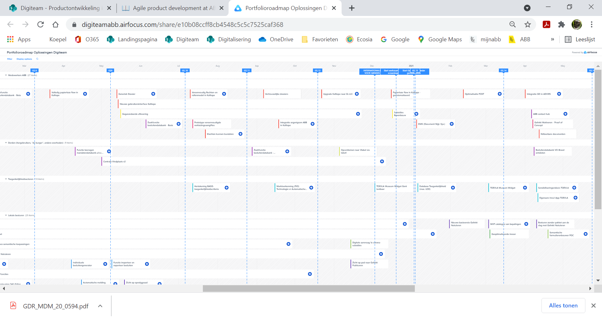
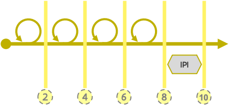

# Agile product development at ABB

The way we develop our products and collaborate together is based on the [Scaled Agile Framework (SAFe)](https://www.scaledagileframework.com), be it with some adaptations to better match our ABB Digiteam way of doing things and the number of people in our team.

## Agile product development! Why?

Big challenges are broken down in smaller, manageable parts. In doing so a constant flow emerges and as a team we can see our solutions grow.

* Transparent overview on the work done and to be done
* Divide our work in manageable parts
* Plan enough and plan in a flexible way
* Getting the responsabilities in the right place

## We try to keep a constant pace on three levels:

* Our Rolling Wave based[ **roadmap**](broken-reference) looks ahead for at least one year.
* The [**Groeispurts**](broken-reference) of ten weeks systematically end with a [**Centrale Planningsdag**](broken-reference).
* Every Groeispurt consists out of four [**sprints**](broken-reference) and one[ **IPI**](broken-reference).


The release of product features that have been developed and tested is not necessarily linked to the pace we follow at our three levels.&#x20;


### Roadmap

We use a comprehensive roadmap. We find it important to define for who a specific functionality will provide value. This roadmap can be found in our [online-tool](https://digiteamabb.airfocus.com/share/e10b08ccff8cb4548c5c5c7525caf368) which is linked to JIRA. JIRA is used by the productteams to plan and follow-up sprints and spurts.

Creating and adjusting the roadmap is a continuous process: this is adjusted every spurt in function of the results and experiences of the past spurt and any additional goals or changed priorities.

### Spurten and Sprinten?

#### Groeispurt ('Growthspurt')

A 'groeispurt' has a duration of ten weeks. It contains four development sprints and one Innovation and Planning Iteration. During the last week of a groeispurt a Centrale Planningsdag (CPD) is held where the goals for the next groeispurt are being determined and feature planning for the products are made and agreed upon.&#x20;

Because we all work in periods of ten weeks, we keep sufficient focus on setting the necessary steps in the development of our products and at the same time we remain agile to cope with ever changing contexts. In doing so the scrum teams have a clear focus on the spurt and sprint goals for the upcoming ten weeks, leaving room for focus shift in the next Groeispurt in case priorities within ABB are all of a sudden changing.&#x20;

#### (Development) Sprint

A sprint is well defined period of two weeks in which the product team starts working together to achieve a clear sprint goal. Sprints are following each other immediately and have fixed elements/ rituals:&#x20;

* Sprint Planning
* Standup
* Sprint demo&#x20;
* Sprint Retrospective
* Backlog refinement

#### Innovatie en Planning Iteratie (IPI)

Next to the development of features, which is a core focus for every product scrum team, there is a need as well for other activities that make product teams grow. For that reason every last two weeks of a Groeispurt are atypical because it explicitly makes room for …&#x20;

* Innovation and experiments
* Training
* Planning activities for the next Groeispurt

When? The Innovation and Planning (IPI) iteration is organized at the end of a Groeispurt.

#### Common structure for organizing the IPI at Digiteam ABB

To organize the activities that are typically done in the IPI we made a calendar and plotted the must-have activities on that calendar. In plotting the activities we took into account some preferences of the team regarding meeting days and tried to group the innovation activities as one block to prevent focus drift between innovation and planning meetings. This calendar is being used as well to put placeholders for certain IPI activities in the personal calendars of people who need to attend.&#x20;

Typical IPI-activities are: testing new technologies, sharing newly developped functionalities with other teams, knowledge transfer, scoping sessions & brainstorms, retrospectives,  …

Our IPI calendar at ABB currently looks like:

_**WEEK 1 IPI: FOCUS on sprintplanning IPI - Innovation - Inspect and adapt**_

| Day/Part | Monday                               | Tuesday                                         | Wednesday                      | Thursday                       | Friday                                |
| -------- | ------------------------------------ | ----------------------------------------------- | ------------------------------ | ------------------------------ | ------------------------------------- |
| AM       | Sprintplanning IPI                   | [Innovation](broken-reference)                  | [Innovation](broken-reference) | [Innovation](broken-reference) | [Inspect and Adapt](broken-reference) |
| AM       | ([Retrospectieve](broken-reference)) | [Capacity check](broken-reference) DEV + Design |                                |                                |                                       |
| PM       | [Innovation](broken-reference)       | [Innovation](broken-reference)                  | [Innovation](broken-reference) | [Innovation](broken-reference) | [Inspect and Adapt](broken-reference) |
| PM       | ([Retrospective](broken-reference))  |                                                 |                                |                                |                                       |

_**WEEK 2 IPI: Focus on Groeispurtplanning (CPD and prep) - Retrospective and Sprintdemo IPI**_

| AM | [Impact Mapping](broken-reference) | [Impact Mapping](broken-reference) | [Story Mapping](broken-reference)                    | [CPD](broken-reference) | [Retrospective](broken-reference) |
| -- | ---------------------------------- | ---------------------------------- | ---------------------------------------------------- | ----------------------- | --------------------------------- |
| AM | [Story Mapping](broken-reference)  | [Story Mapping](broken-reference)  | [Impact Mapping](broken-reference)                   |                         |                                   |
| PM | [Impact Mapping](broken-reference) | [Impact Mapping](broken-reference) | [Capacity Check](broken-reference) PM's ifv planning | [CPD](broken-reference) | Sprintdemo IPI                    |
| PM | [Story Mapping](broken-reference)  | [Story Mapping](broken-reference)  |                                                      |                         | Prepare backlog for sprint 1      |
|    |                                    |                                    |                                                      |                         |                                   |


The capacity of an IPI can not be used to reach the Groeispurt targets and thus may not be considered as an extra sprint to build product features. The sprint should be used to give the teams time to work on innovation for future purposes, to document what was built, to prepare and plan the next Groeispurt and to look back on how the team performed in the Groeispurt that is approaching its end.


### Central Planning Day - CPD

The central planning day is a crucial moment to look back at the Groeispurt that is ending and to look ahead and plan for the next Groeispurt. Therefore it is situated inbetween two Groeispurts.&#x20;

It provides time for all actors involved in our agile product development to …&#x20;

* show wat has been realised in a series of plenary product demo's.
* plan the next Groeispurt using the preparation that has been made in the days proceeding the CPD. Ultimately epics (product features) will be planned for execution. Their execution will contribute to the  [oplossingen](broken-reference) they are linked to.
* align with other product teams to realise shared solutions.&#x20;

Het programma van een CPD is gebaseerd op de onderdelen van het standaardprogramma dat binnen het Scaled Agile Framework wordt beschreven maar de activiteiten worden doorheen de volledige IPI verspreid. De belangrijkste finale afstemming gebeurt op een één dag.

<table><thead><tr><th width="150"></th><th>What?</th><th>Purpose</th><th>Attendees</th></tr></thead><tbody><tr><td>In advance (before the CPD)</td><td>Impact mapping for every value stream</td><td>Overview of possible deliverables</td><td><ul><li>PM's &#x26; PO's,</li><li><strong>Solution level</strong></li><li>Designers</li><li>Business Analists </li><li>Business-reps</li></ul></td></tr><tr><td>In advance</td><td>Retrospective for every product team</td><td>Look back and learn from experiences in the previous groeispurt</td><td>Every team member of a product team</td></tr><tr><td>In advance</td><td>Preparation CPD with the product team</td><td>What is to be done next, in the upcoming groeispurt. - Storymapping - Planning on CPD-canvas</td><td><ul><li><strong>PM en PO</strong> </li><li>Development leads</li></ul></td></tr><tr><td>In advance</td><td>Capacitycheck - sync with dev's and designers</td><td>Matching demand and supply of developers and designers for the upcoming groeispurt</td><td><ul><li>RedPencil</li><li>Hannes</li><li>Veronique</li></ul></td></tr><tr><td>In advance</td><td>Capacitycheck - sync with PO's and PM's</td><td>Feedback to PM's and PO's on the availability + capacity of developers and designers to PM's and PO's.</td><td><ul><li>PO's</li><li>PM's</li><li>Veronique</li></ul></td></tr><tr><td>9h00 - 9h15</td><td>Introduction to the CPD (IT-director + Manager Digital Solutions)  </td><td>Introduction, setting the stage</td><td><ul><li>PM's &#x26; PO's</li><li>Product teams</li><li>Business-reps</li><li><strong>Solution level</strong></li></ul></td></tr><tr><td>9h15 - 10h30</td><td>(product)demo's for every value stream on achievements previous Groeispurt</td><td>Show what has been delivered by the product teams for all relevant value streams</td><td>

<ul><li><strong>PM's &#x26; PO's</strong></li><li>Product teams</li><li>Business-reps</li><li>Solution level</li></ul></td></tr><tr><td>10h30 - 15h00</td><td>Break-outsessions per value stream</td><td>Final rundown of the planning for the various product teams collaborating in value streams</td><td><ul><li><strong>PM's &#x26; PO's</strong></li><li>Relevant product teams</li><li>Business-reps</li></ul></td></tr><tr><td>15h00 - 15h30</td><td>Finalizing groeispurt planning per product</td><td>Moment for PM's and PO's to finalize the product planning before presenting it on the plenairy session.</td><td><ul><li><strong>PM's &#x26; PO's</strong></li></ul></td></tr><tr><td>15h30-16h30</td><td>Presentation of sprint planning and sprint goals per product</td><td>Presentation of the planning per product team. The presentation implies an implicit confidence vote by the teams involved.</td><td>

<ul><li><strong>PM's &#x26; PO's</strong></li><li>Productteams</li><li>Business-reps</li><li>Solution level</li></ul></td></tr></tbody></table>

When? The central planning day (CPD) is organised every second Thursday of the IPI.
