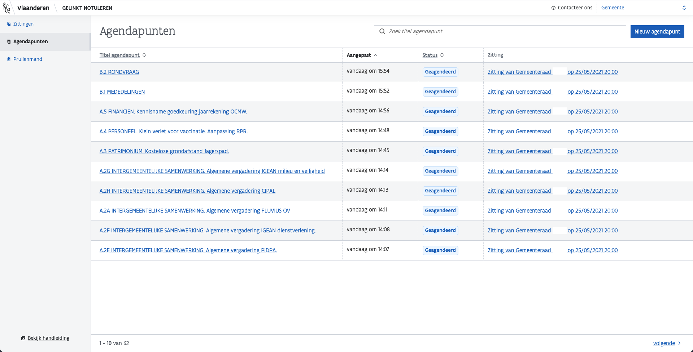

# Fase 3: Zitting vervolledigen


Notulen worden over het algemeen niet aangevuld tijdens de zitting, maar asynchroon verwerkt.


## Informatie zitting vervolledigen: zitting

De context waarin de agendapunten behandeld worden kan nu meegegeven worden.

**\[hulp nodig: in deze context secretaris of algemeen directeur?\]**

| Onderdeel | Informatie | Gelinkte informatie | Wordt gepubliceerd in |
| :--- | :--- | :--- | :--- |
| **Startdatum** | De dag waarop de zitting doorging. | Ja | Notulen, uittreksels |
| **Startuur** | Wanneer de zitting gestart werd door de voorzitter. | Ja | Notulen, besluitenlijst, uittreksels |
| **Aanwezigen zitting** | Wie er aanwezig was bij de start van de zitting. | Ja | Notulen, besluitenlijst, uittreksels |
| **Afwezigen zitting** | Wie er afwezig was bij de start van de zitting. | Ja | Notulen, besluitenlijst, uittreksels |
| **Voorzitter \(of vervanging\)** | Wie de rol van voorzitter van de raad op zich nam. | Ja | Notulen, besluitenlijst, uittreksels |
| **Secretaris \(of vervanging\)** | Wie de rol van secretaris van de raad op zich nam. | **Ja** | Notulen, besluitenlijst, uittreksels |

## Verloop van de zitting vervolledigen: behandeling van agendapunt

Vervolgens worden per agendapunt aanwezigen, stemmingen en het besluit ingegeven worden. Er kunnen meerdere stemmingen per agendapunt gehouden worden.

**\[Hulp nodig: wordt de stemming ook meegegeven aan de besluitenlijst?\]**

| Onderdeel | Informatie | Gelinkte informatie | Wordt gepubliceerd in |
| :--- | :--- | :--- | :--- |
| **Aanwezigen agendapunt** | Wie er aanwezig was bij het agendapunt. | Ja | Notulen, uittreksels |
| **Afwezigen agendapunt** | Wie er afwezig was bij het agendapunt. | Ja | Notulen, uittreksels |
| **Openbaarheid agendapunt** | De werkelijke behandeling van het agendapunt: openbaar of besloten. | Ja | Notulen, uittreksels |
| **Onderwerp stemming** | Waar gaat de stemming over | Ja | Notulen, besluitenlijst uittreksels |
| **Type stemming** | Geheim of open | Ja | Notulen, besluitenlijst uittreksels |
| **Voorstanders** | Aantal voorstanders: enkel cijfers indien geheim, naam aanwezige ook indien open. | Ja | Notulen, besluitenlijst uittreksels |
| **Tegenstanders** | Aantal tegenstanders: enkel cijfers indien geheim, naam aanwezige ook indien open. | Ja | Notulen, besluitenlijst uittreksels |
| **Onthouders** | Aantal onthouders: enkel cijfers indien geheim, naam aanwezige ook indien open. | Ja | Notulen, besluitenlijst uittreksels |
| **Gevolg stemming** | Wat is het gevolg van deze stemming. | Ja | Notulen, besluitenlijst uittreksels |

## **Hoe werkt het in GN?**

Bekijk hoe het werkt in Gelinkt Notuleren **\[Hulp nodig: aparte pagina aanmaken?\]**



### Rollen

Het is belangrijk dat elke dienst en alle medewerkers van de secretarie hier de rol `Schrijver` hebben. Dit wordt ingesteld op het [Gebruikersbeheer](https://overheid.vlaanderen.be/ict/ict-diensten/gebruikersbeheer) \(ACM-IDM\), meestal door de IT dienst van het lokaal bestuur.

* `Lezer` kan alle agendapunten bekijken.
* `Schrijver` kan alle agendapunten bekijken en bewerken.

### **Locatie**

In Gelinkt Notuleren kunnen dossiers voorbereid worden in de tab **Agendapunten**. Het is ook mogelijk om rechtstreeks een zitting aan te maken en daar agendapunten toe te voegen – maar dat is minder flexibel.

### Status

Vanaf het moment dat een een zitting gepubliceerd wordt, kan je het niet meer van de zitting ontkoppelen, en krijgt het agendapunt de status`gepubliceerd` .

Agendapunten die verdaagd werden kunnen gekopieerd worden, zodat ze niet opnieuw opgebouwd moeten worden.

