# \[verouderd\] Hoe de handleiding aanpassen mét html editor


We gaan de oude handleidingen in de toekomst niet meer gebruiken. Deze zullen vervangen worden door Gitbook.


### 1. Voorbereiding 

Uiteindelijk willen we een zo eenvoudig mogelijke workflow bekomen zodat er in principe niets kan mislopen op de live omgeving. We treffen daarom enkele voorbereidingen:

#### Een Github account aanmaken

Surf naar [_github.com/join?ref..._](https://github.com/join?ref_cta=Sign+up&ref_loc=header+logged+out&ref_page=%2F&source=header-home) en volg de instructies om een nieuwe account aan te maken. 

_Heb je al een account kan je deze stap overslaan._

#### Toegang vragen tot de repository

Vraag aan een van de designers of ontwikkelaars toegang tot de repository die je wil bewerken.   
In ons geval de repository waar de handleiding van gelinkt notuleren staat:

[https://github.com/lblod/handleiding-gelinkt-notuleren](https://github.com/lblod/handleiding-gelinkt-notuleren)

#### Atom setup:

_Atom installeren_

Klik op de [link ](www.atom.io)en download de versie van Atom voor jouw besturingssysteem \(Windows / Mac\),

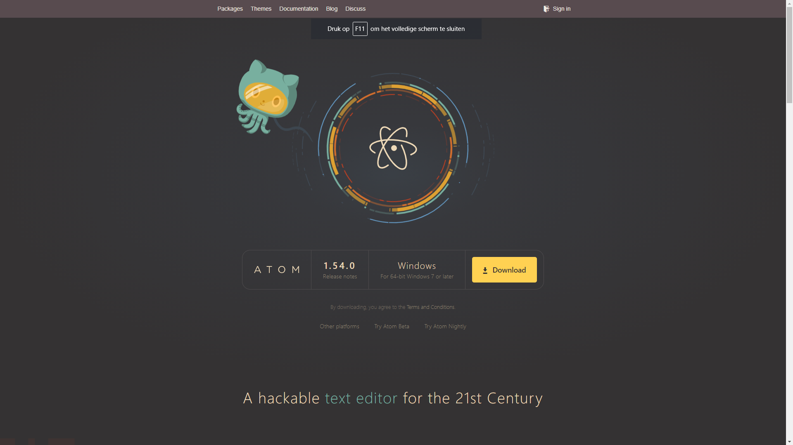

_Xcode installeren \[enkel op MAC\]_

Als je met een Mac toestel werkt, heb je de Xcode developer tools nodig.   
Tenzij je zeker bent dat je deze tools al hebt, voer je deze stap best uit. 

Open een Terminal scherm en typ:

```text
xcode-select --install
```

Druk op enter om het commando uit te voeren, eens de installatie klaar is mag je dit scherm sluiten en Atom herstarten. 

_Packages toevoegen in Atom_

Om een live-preview van de html-code te zien, moeten we een package toevoegen aan Atom:  
'Atom-live-server'

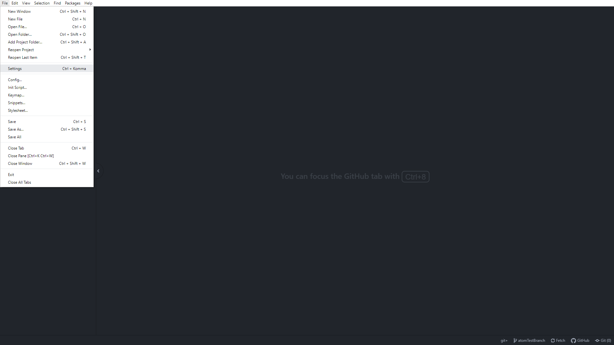

Windows:  
In Atom klik op: File &gt; Settings, en ga dan naar Install. 

Mac:  
In Atom klik op: Atom &gt; Preferences, en ga dan naar Install.

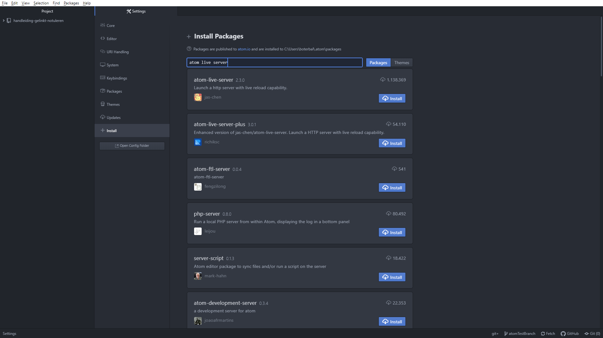

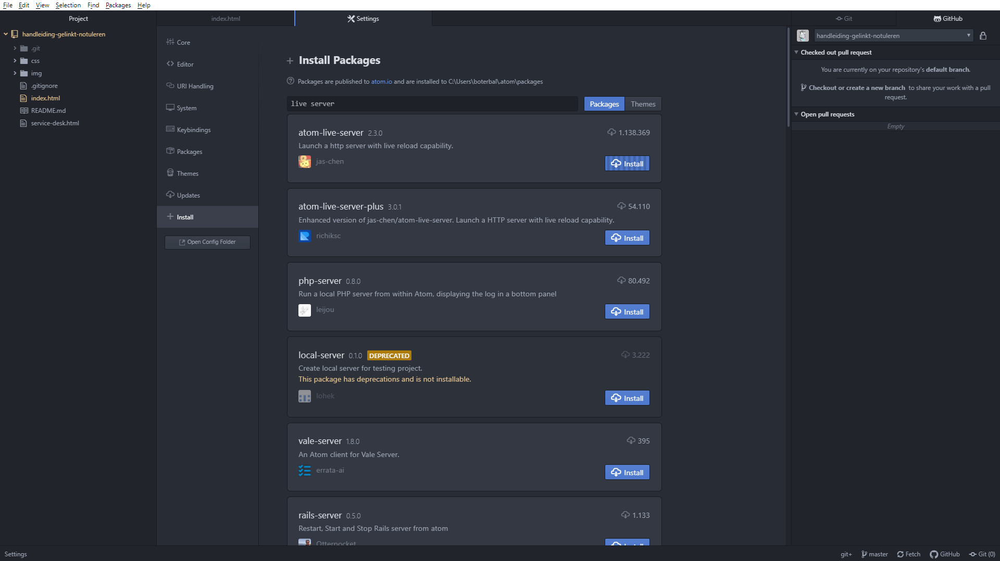

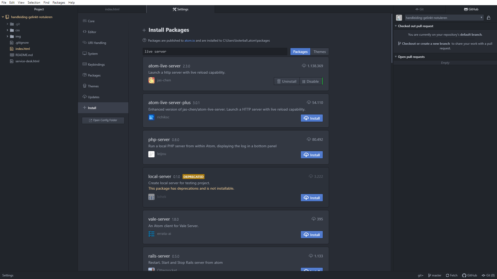

### 2. Atom workflow

#### GitHub account linken in Atom

~~Zorg ervoor dat je GitHub account aangemeld is op de GitHub site en kopieer dan het token op deze link:   https://github.atom.io/login~~      
_Onduidelijk gedrag, lijkt vaak automatisch te linken._ 

#### De Github repository toevoegen \(= een lokale kopie maken\).

Surf eerst naar de github pagina van de handleiding, en zorg ervoor dat je op de MASTER branch zit.   
Klik op de groene knop CODE en selecteer HTTPS indien nodig. Kopieer de URL.

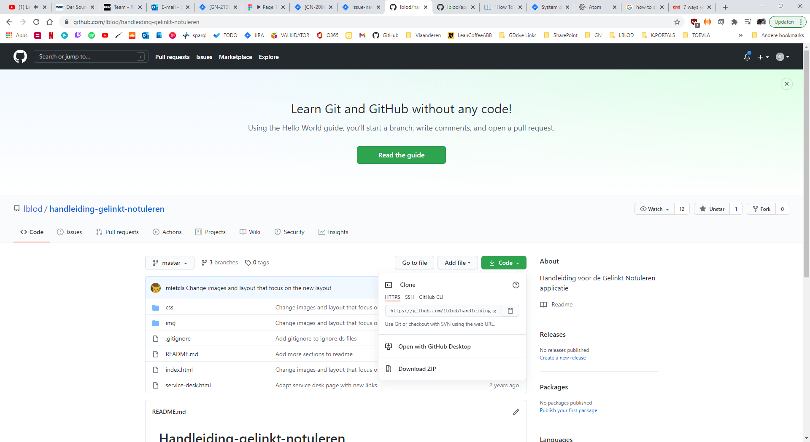

#### De repository toevoegen aan Atom

Open het GitHub panel, en klik op: Clone an existing repository.  
Plak de URL in de pop-up. 


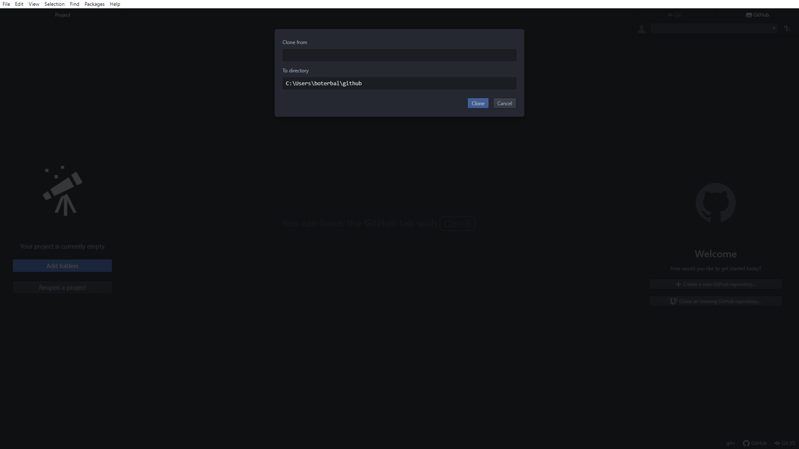

Atom zal een locatie voorstellen, tenzij je deze wil ergens anders wil kan je gewoon opslaan.

#### \(ATOM resetten\) 

In het geval dat twijfelt over je Atom settings, kan je deze heel makkelijk naar de start waarden herstellen:  
  
https://flight-manual.atom.io/hacking-atom/sections/debugging/\#reset-to-factory-defaults  
_\(verder uitschrijven\)_

### 

### 3. Aanpassingen maken in met Atom

Je zal zien dat er op je pc een nieuwe folder is verschenen identiek aan de master branch die op Github staat. 


#### Een nieuwe branch maken

Rechts onderaan in Atom zie je de GitHub balk, standaard zitten we in de master branch.

Door op de branch naam te klikken open je het submenu waar je een andere branch kan selecteren of een nieuwe aanmaken. Klik op New Branch Kies een logische naam voor je nieuwe branch zodat je makkelijk herkent waar je aan het werken was. \(bv. updateInleiding, toevoegenHoofdstuk5 etc\)

OPGELET! Begin nooit in de code te knoeien op je master branch, maak altijd eerst een nieuwe branch aan via deze stap \(of werk verder op een bestaande branch als je snapt hoe je dit doet\). Indien je dit wel gedaan hebt bestaat de kans dat de volgende keer met problemen zal komen te zitten.!!


#### De code previewen

Om een preview van de code te zien gaan we gebruik maken van het package atom-live-server die we eerder hebben geïnstalleerd.

In het project scherm aan de linkerzijde open de folder: handleiding-gelinkt-notuleren en open de index.html . Klik bovenaan het scherm op Packages, dan op atom-live-server &gt; start server.

Je krijgt nu een preview van de handleiding in je standaardbrowser te zien.

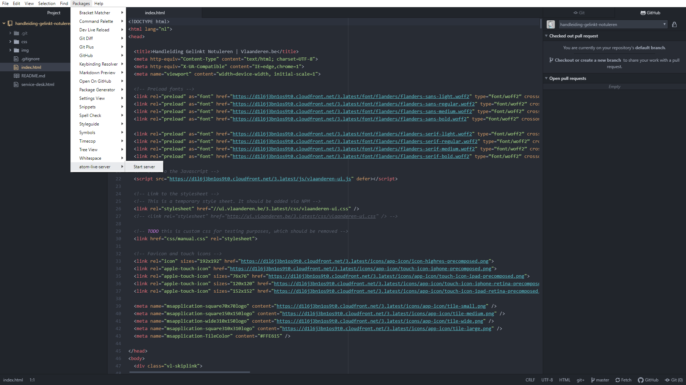

#### Aanpassingen zichtbaar maken

Als je de inhoud hebt aangepast zal je dit niet meteen zien in de preview, door het index.html document op te slaan zullen je wijzigingen zichtbaar worden in de browser : 

```text
Windows:     Ctrl + S
Mac:         Cmd  + S
```

### 

### 4. Opslaan op de GitHub repository

#### Je wijzigingen opslaan op je branch: COMMIT

In de vorige stap behandelden we het opslaan van de code op jouw persoonlijke machine, maar we willen deze ook online updaten. Een commit is zoveel als vlagje voor een tussenstap in je werk, stel dat je 10 hoofdstukken moet updaten, kan je na elk hoofdstuk een aparte commit maken:

Open de Git Tab door rechtonder op Git te klikken. Zorg ervoor dat al je aanpassingen opgeslagen zijn \(zie vorige stap\) anders zal je hier geen 'Unstaged Changes' zien, en kan je niet verder!

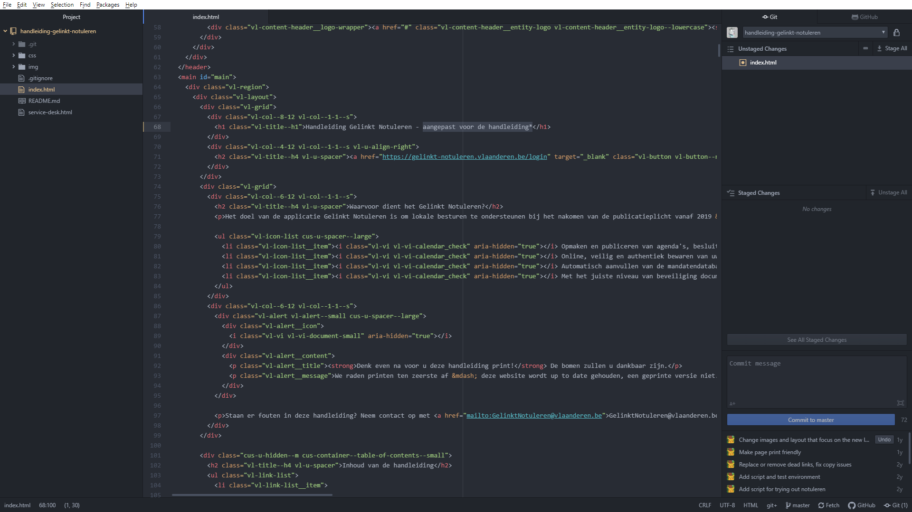

In het Git tabblad zal je bovenaan Unstaged Changes zien staan, dit zijn je \(lokaal\) opgeslagen aanpassingen per document. Voor ons staat er enkel index.html, dat klopt dus klikken we op Stage All.

Nu moet je in 1 zin al je werk samenvatten \(commit message\), kort en bondig een beetje zoals de naam voor je branch. Dit is de commit, als je tevreden bent klik je op de blauwe knop commit.

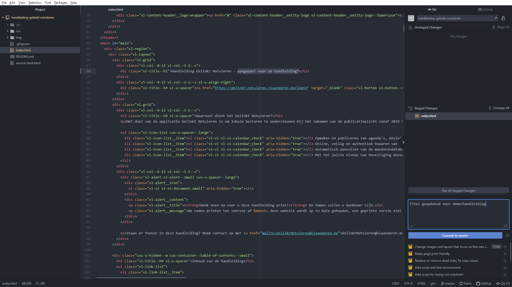

#### Je lokale branch pushen

Rechtsonderaan: Publish / PUSH -&gt; Atom vraagt voor credentials van github

ZORG ERVOOR DAT JE NIET OP DE MASTER BRANCH WERKT ALS JE PUSHT!

\(WAAROM? -&gt; Op deze manier kan iemand anders steeds verder werken op jouw branch zonder dat je je laatste versie moet doorsturen. \)

#### Een nieuwe pr maken

Ga naar GitHub en navigaar naar de handleiding, er is een normaal gezien een update dankzij de commit die we gemaakt hebben in de vorige stap.

Klik op de groene knop: "Compare & pull request"

Kijk op de volgende pagina de volgende gegevens goed na en vul aan:

base: MASTER compare: 'de naam van jouw branch'

Able to merge -&gt; als deze tekst niet verschijnt zal er hoogstwaarschijnlijk iets mislopen als we deze update naar productie brengen. Probeer eerst zelf uit te zoeken wat het probleem is, maar verlies hier zeker niet teveel tijd aan en vraag op tijd hulp aan een collega die ervaring heeft met GitHub.

Vul aan: Geef de Pull-Request een titel en een beschrijving, en voeg minstens één reviewer toe.

Klik op Create PullRequest.

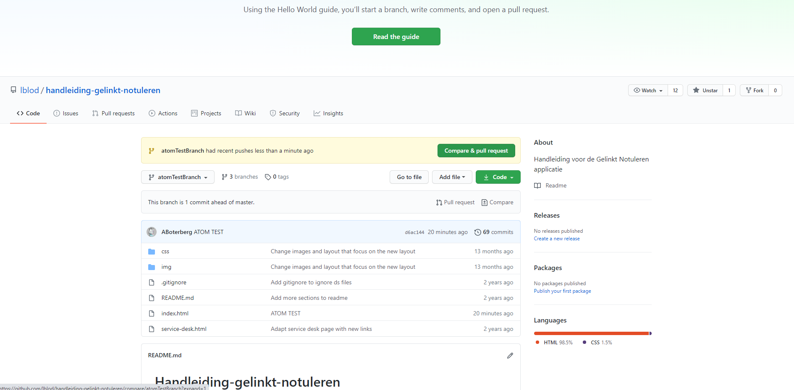

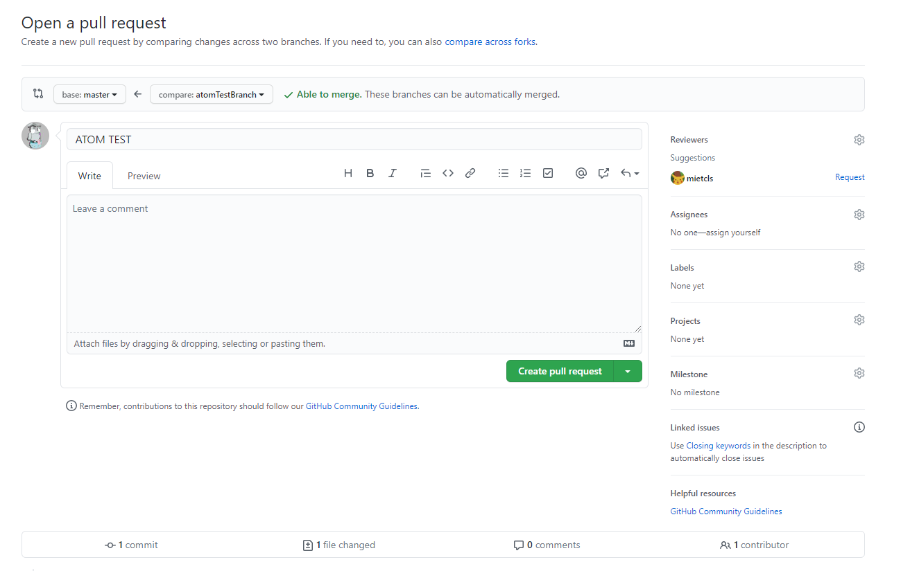


Succes! 



