# \[verouderd\] De HTML van de handleiding aanpassen zonder HTML editor of gebruik van Terminal


We gaan de oude handleidingen in de toekomst niet meer gebruiken. Deze zullen vervangen worden door Gitbook.



\[EN\] this how-to is only in Dutch, because the manuals have to be in Dutch themselves. We do not expect non-Dutch speaking people to adapt the manuals.



\[NL\] Deze how-to gaat er van uit dat je kennis hebt van HTML. Kennis van CSS is niet nodig, we gaan enkel inhoud aanpassen – hoe je classes in HTML gebruikt is wel nodig.

Twijfel je aan hoe bepaalde stukken HTML werken? Twijfel je hoe je de CSS classes gebruikt? Neem contact op met de designer van het corresponderende product.


### 1. Ga naar de repository voor de relevante handleiding

We hebben nu 2 handleidingen:

* Gelinkt Notuleren: [https://github.com/lblod/handleiding-gelinkt-notuleren](https://github.com/lblod/handleiding-gelinkt-notuleren)
* Loket voor Lokale Besturen:  [https://github.com/lblod/handleiding-digitaal-loket](https://github.com/lblod/handleiding-digitaal-loket)

### 2. Open de index.html file, en bekijk de "raw" \(ruwe\) inhoud

De index.html file zal je de HTML tonen die al de informatie die je in de handleiding ziet toont \(zonder stijl\).

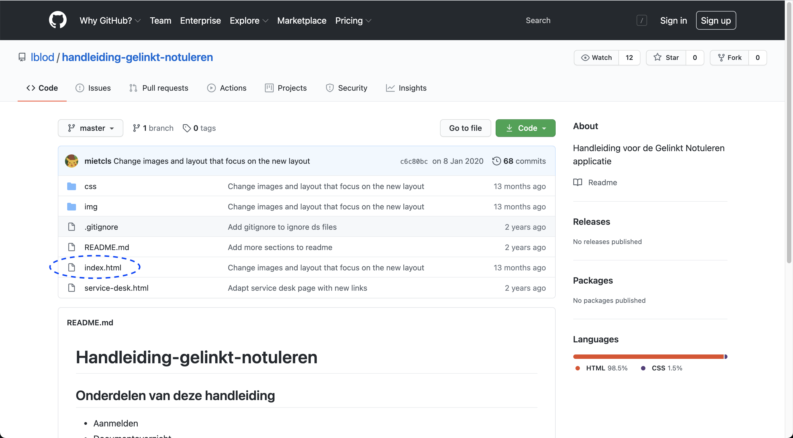

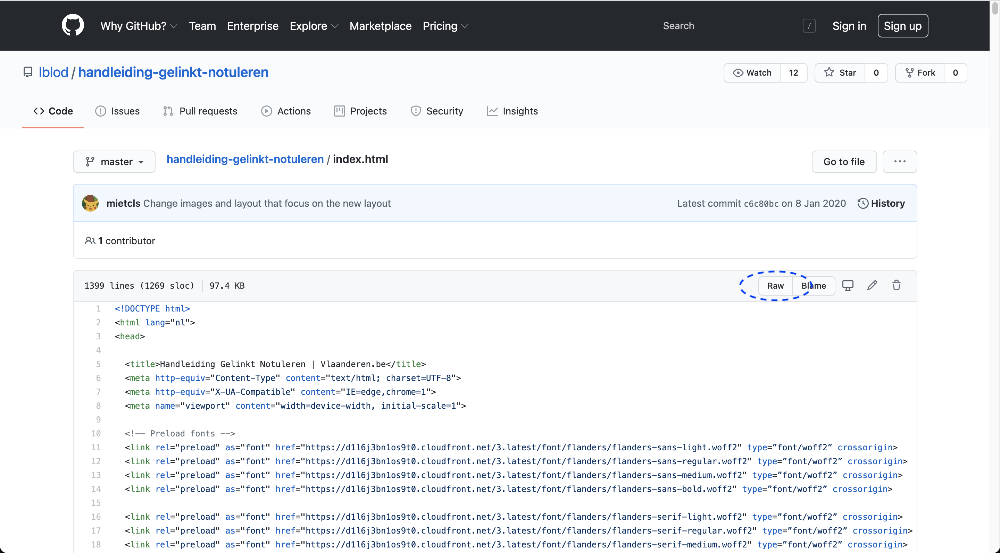

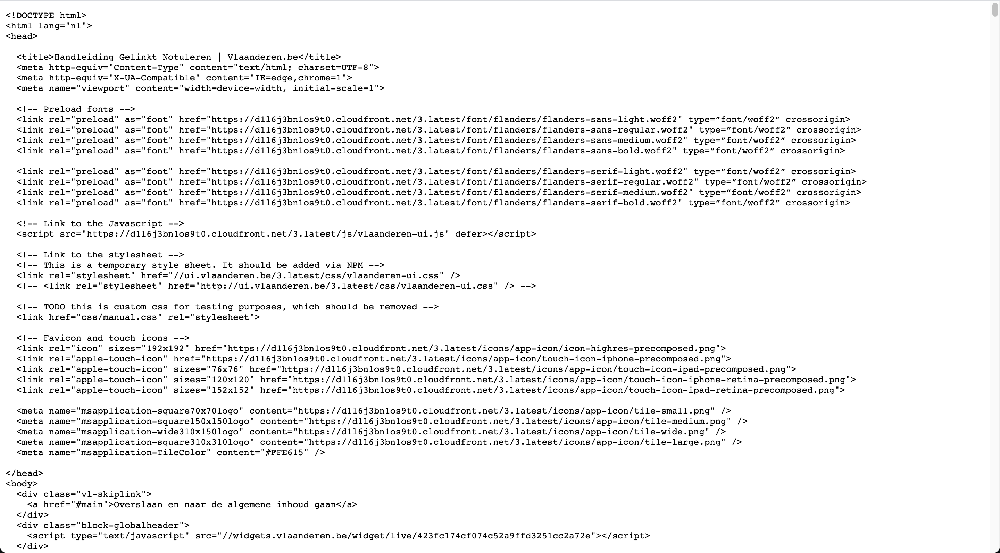

### 3. Kopieer de raw HTML, en plak deze in codepen.io 


Heb je wel ervaring met code editors, en kan je zelf de handleiding lokaal simuleren? Sla deze stap over.


Bezoek [https://codepen.io](https://codepen.io/pen/) en start met coderen \(als je een account aanmaakt kan je ook je code bijhouden, ze noemen dat _pens_\).

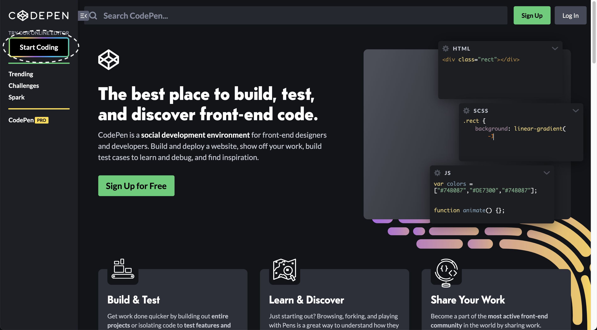

Plak de raw HTML code in de HTML editor.  De handleiding zou nu moeten verschijnen, zonder afbeeldingen.

Afbeeldingen zullen we later moeten toevoegen, maar je kan de relevante screenshots al maken – in hoge resolutie. Plak de afbeeldingen niet in Word, maar bewaar ze als PNG bestand op zich dat je later in hoge resolutie kan delen. Contacteer de designer die op dat moment op het product werkt waar jij een handleiding voor aan het maken bent, en overleg om dat in orde te brengen. Als je de website lokaal kan downloaden en simuleren, kan je de afbeeldingen wel zelf toevoegen.

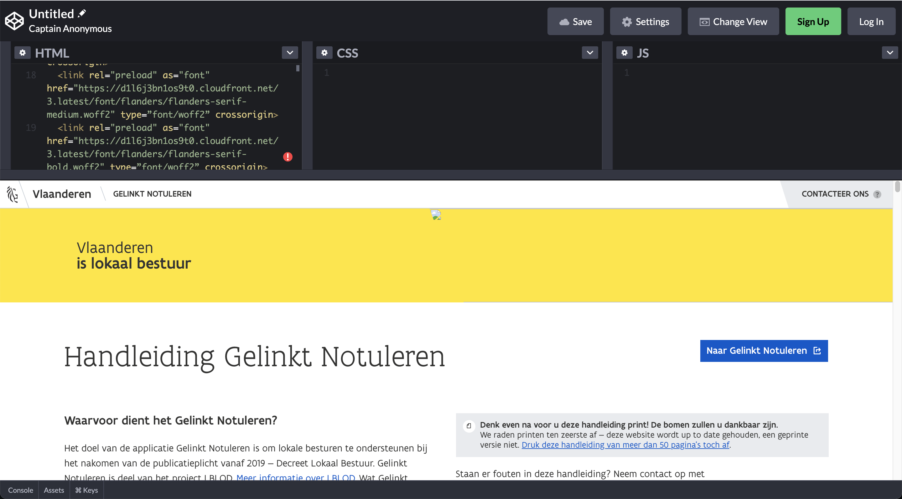

### 4. Je code zichtbaar maken voor anderen \(met een nieuwe branch\)


Kan je via jouw code editor ook code pushen? Bewerk de code in jouw editor en maak een nieuwe branch vanuit de Master branch volgens de structuur feature/beschrijving-taak. Commit en push de code in die branch. Ga vervolgens naar de stap 5.


#### Code bewerken

Eens je klaar bent met je code te bewerken in codepen \(of je code editor\), ga je weer op zoek naar de index.html.


Zorg telkens dat je van de **Master** branch start \(links bovenaan, onder "code"\), dat is voor de handleiding het meest veilig, omdat dat de versie is die op productie staat.


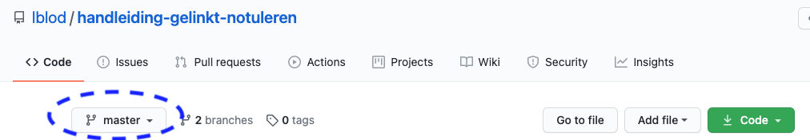

Klik daarna op de "bewerk" knop, een pen icoon aan de rechterkant.

Er opent zich een teksteditor. Daar kan je de hele codeblok vervangen door de code die jij in codepen geschreven hebt, of enkel de relevante delen vervangen.

#### Code zichtbaar maken

_Als de code vervangen werd, beschrijf wat je gedaan hebt._

De titel: maximum 50 karakters, en "gebiedende wijs" \(vertel wat je wil dat er gebeurt\) en in het Engels \(indien mogelijk\).

De beschrijving: hier kan je, indien nodig, meer beschrijven wat er gebeurt is. Dat helpt de persoon die je code nakijkt om te ontdekken waar deze op moet letten.

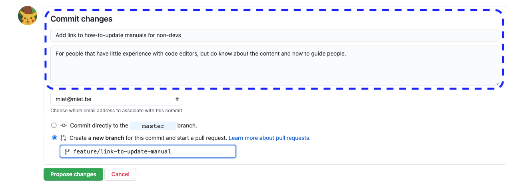

_Kies vervolgens "create a new branch for this commit, and start a pull request"._

Commit nooit rechtstreeks op de master branch zelf.


Volg de structuur: feature/naam-van-de-feature \(vb. feature/nieuwe-module of feature/herwerken-publicatie\) – dit maakt het duidelijk voor iedereen.


_Maak de code beschikbaar voor anderen door op "propose changes" te klikken._

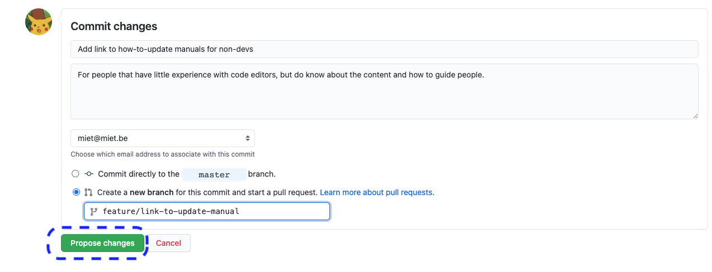

Vervolgens [laat je de code nakijken](./#5-je-code-laten-nakijken-in-een-pull-request), voor deze in productie gezet kan worden. Je kan ook later [extra aanpassingen doorvoeren in dezelfde branch](./#switchen-naar-een-bestaande-branch) en daarna pas laten nakijken.

### 5. Je code laten nakijken in een _Pull Request_

Om ervoor te zorgen dat je code in productie gaat, moet er eerst iemand je code testen en nakijken. Dit doe je door een **pull request** te doen. Je krijgt een gelijkaardige interface te zien.

1. Pull request maken
   1. _Kom je van stap 4?_  Deze stap verschijnt automatisch.
   2. _Heb je stap 4 overgeslagen?_  Ga naar "pull requests" en zorg dat je jouw nieuwe branch vergelijkt met de master branch om je pull request mee te starten.
2. Beschrijf wat je wil dat er wordt nagekeken. Dit kunnen meerdere aanpassingen zijn.
3. Voeg een reviewer toe, de persoon die je code zal testen en nakijken. Kies de designer die op dat moment op het project zit.
4. Klik op "Create pull request".
5. Wacht tot de code nagekeken is door je reviewer. Merge de code niet vóór iemand heeft nagekeken. Je kan, eens de code nagekeken is, zelf mergen of het wordt voor jou gemerged.
   1. Mergen betekent: je code samenvoegen met de code die op master zit, die later gedeployed wordt.

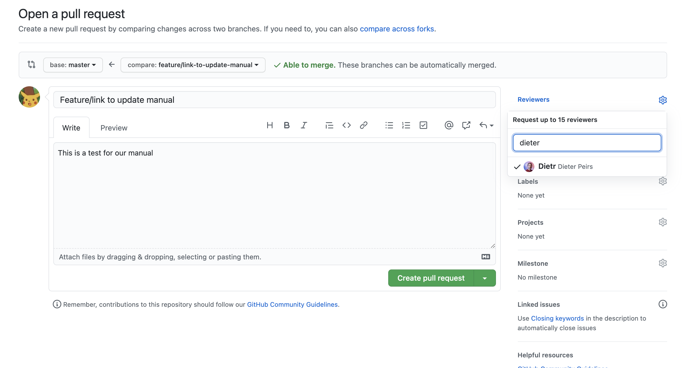

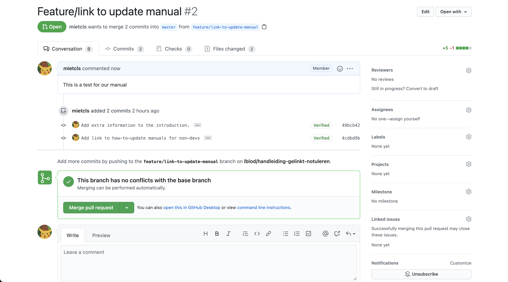

### 6. Deployen

Enkel developers kunnen handleidingen deployen. Vraag aan de lead developer van het project om de handleiding te deployen eens deze nagekeken werd en in de master branch zit. Dat kan enkel wanneer ook de applicatie gedeployed wordt, dus doe het ruim op voorhand zodat dit ingepland kan worden.

### 7. Branch verwijderen

#### Is je werk klaar, de code gedeployed en zal je die branch niet meer gebruiken? Verwijder de branch.

Dat doe je bij "branches". Zo houden we het overzichtelijk.

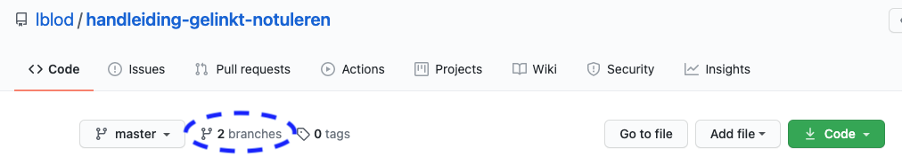

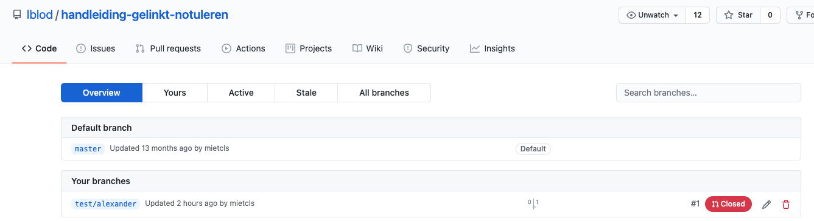

## Een bestaande branch hergebruiken voor meerdere aanpassingen \(commits\) zonder html editor.


Zorg dat je rechten hebt om code te sturen naar de repository. Je kan daarvoor terecht bij de lead developer van het corresponderende product, of vragen aan de designer wie dat is.


#### Branches

Repositories hebben "branches". De Master branch is de code die je in productie ziet, eens de handleiding gedeployed is. Andere branches zijn kopieën van die Master branch, om ervoor te zorgen dat ongelukjes of experimenten niet zomaar in productie gaan. _Commit of stuur nooit rechtstreeks code naar de master branch._

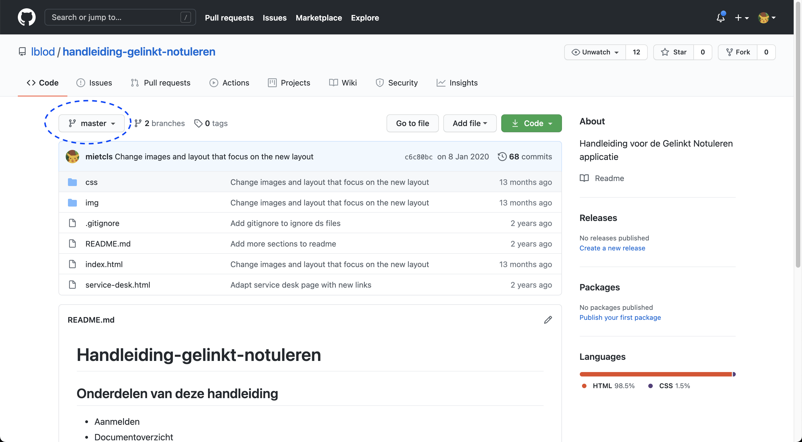

#### Waarom een bestaande branch hergebruiken?

Code sturen naar bestaande branches is handig wanneer je foutjes hebt ontdekt in de aanpassingen van die branch, of wanneer je nog iets wil toevoegen. Zorg er wel zeker voor dat deze branch altijd gestart werd vanuit een recente versie van de Master branch, zodat je later de code zonder problemen kan samenvoegen.

### Code sturen \(committen\) naar naar een bestaande branch

#### Hoe wisselen naar een bestaande branch

Wanneer je naar de repository surft, zit je automatisch op de Master branch. Wissel naar de specifieke branch voor jouw feature.


Wil je wisselen naar een nieuwe branch? Ga naar [je code zichtbaar maken voor anderen](./#4-je-code-zichtbaar-maken-voor-anderen-met-een-nieuwe-branch) of maak een nieuwe branch aan via jouw workflow \(editor of terminal\).


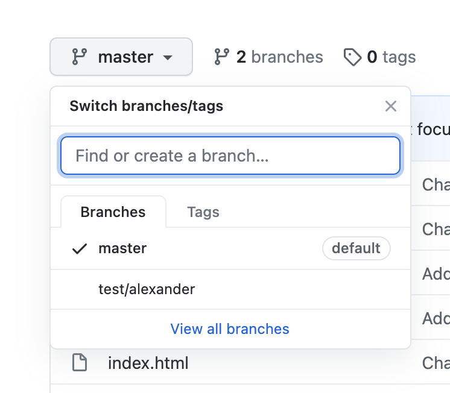

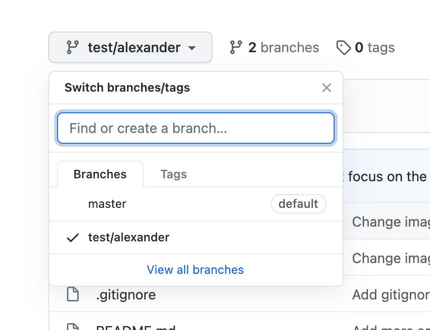

### Je code zichtbaar maken voor anderen in een branch: je code in de branch zetten

Eens je van branch gewisseld bent, ga je weer op zoek naar de index.html.

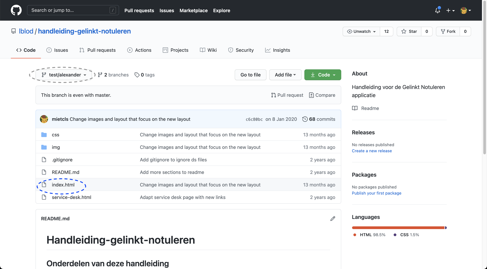

Klik daarna op de "bewerk" knop, een pen icoon aan de rechterkant.

Er opent zich een teksteditor. Daar kan je de hele codeblok vervangen door de code die jij geschreven hebt, of enkel de relevante delen vervangen.

Vervang de code die je aangepast hebt. Commit vervolgens je changes:

* Als de code vervangen werd, beschrijf wat je gedaan hebt.
  * De titel: maximum 50 karakters, en "gebiedende wijs" \(vertel wat je wil dat er gebeurt\) en in het Engels \(indien mogelijk\).
  * De beschrijving: hier kan je, indien nodig, meer beschrijven wat er gebeurt is. Dat helpt de persoon die je code nakijkt om te ontdekken waar deze op moet letten.
* Kies de branch die correspondeert met jouw taak \(niet master!\)
* Klik op "commit changes".
* [Laat je code nakijken](./#5-je-code-laten-nakijken-in-een-pull-request) \(meer en verdere informatie daar te vinden\).

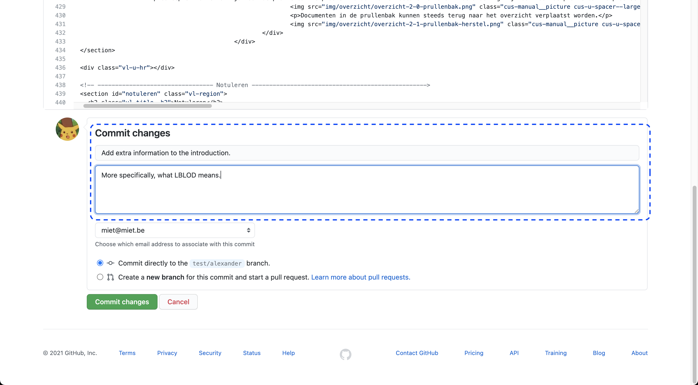


Succes!


