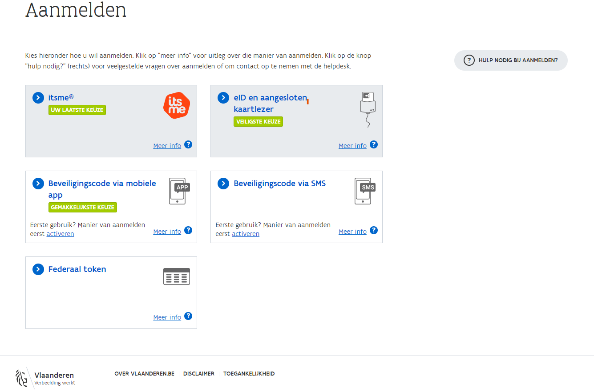

# Toegang krijgen tot de producten en diensten van ABB

## Wat zijn mijn gebruikersrechten?

Bekijk hier tot welke producten en diensten u toegang heeft:



### Pop-up

Vervolgens verschijnt er een pop-up, die u enkele veilige opties voorstelt om u mee aan te melden op het gebruikersbeheer.

### Selecteer namens wie je wil aanmelden

Je kiest voor de optie 'een entiteit van de Vlaamse overheid'.

## Hoofdpagina van Mijn Profiel

### Mijn gebruikersrechten

#### Werkrelatie

In de sectie 'Mijn gebruikersrechten' vind je in het tabblad "Werkrelatie" een overzicht met al je gebruiksrechten voor verschillende toepassingen". Wens je toegang tot een toepassing contacteer dan één van de Hoofd Lokale beheerders van ABB.

#### Mijn Lokale Beheerders

In het tabblad 'Mijn Lokale Beheerders' vind je de contactgegevens van de collega's van ABB die je toegang kunnen geven tot een toepassing binnen de VO.

