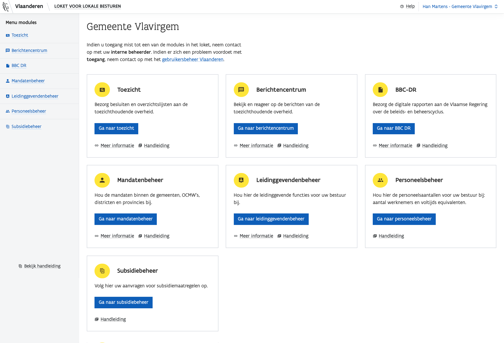

# Signing in

## Browser choice: Firefox of Chrome

To take full advantage of our applications, please use [**Firefox**](https://www.mozilla.org/nl/firefox/new/) **or** [**Chrome**](https://www.google.com/chrome/).


However, it is possible that certain functionalities do not work as they should. Should you notice this, you can always let us know via: [DigitaalABB@vlaanderen.be](mailto:DigitaalABB@vlaanderen.be).


## Making Sure You Are Known as a User to the Flemish Government


Our applications are provided for you to sign in securely through [Gebruikersbeheer Vlaanderen](./).


To access our applications, you must be known as a user in Gebruikersbeheer Vlaanderen.

The **local administrator** who is on each board can give you access to this. Usually this is the secretary/general manager, clerk or someone designated by the organization. So it's best to check with them if you don't know who your local administrator is. [More information about user management.](./)

## Signing in via the Landing Page

Signing up is done through the familiar user management Flanders.

All of our applications have a blue button with "Sign Up" on their landing page. Click on this button to continue. View all web applications of the Domestic Administration Agency.

## Pop-up

Vervolgens verschijnt er een pop-up, die u enkele veilige opties voorstelt om u mee aan te melden.

### Kiezen van een bestuurseenheid

Indien u toegang heeft tot meerdere bestuurseenheden, krijgt u in de pop-up de optie om een bestuurseenheid te kiezen.

### Verschijnt de pop-up niet?

Zorg dat de instellingen van uw browser goed staan.

* **Firefox**

  Bezoek deze link [https://support.mozilla.org/nl/kb/instellingen-pop-upblokkering-uitzonderingen-probleemoplossing](https://support.mozilla.org/nl/kb/instellingen-pop-upblokkering-uitzonderingen-probleemoplossing) en kies **Pop-upblokkeringsinstellingen**.

* **Chrome**

  Bezoek deze link [https://support.google.com/chrome/answer/95472?co=GENIE.Platform%3DDesktop&hl=nl](https://support.google.com/chrome/answer/95472?co=GENIE.Platform%3DDesktop&hl=nl) en zoek naar **Pop-ups van een specifieke site blokkeren of toestaan**. Klik daarna op **Pop-ups van een bepaalde site toestaan**.


Krijgt u geen toegang tot de applicatie? Ga naar [Gebruikersbeheer](../toegankelijk-vlaanderen.md) voor meer informatie.


## Aangemeld

Na het kiezen van een bestuurseenheid, bent u ingelogd. U krijgt nu toegang tot de modules waar u voor gekend staat bij het [Gebruikersbeheer]().

