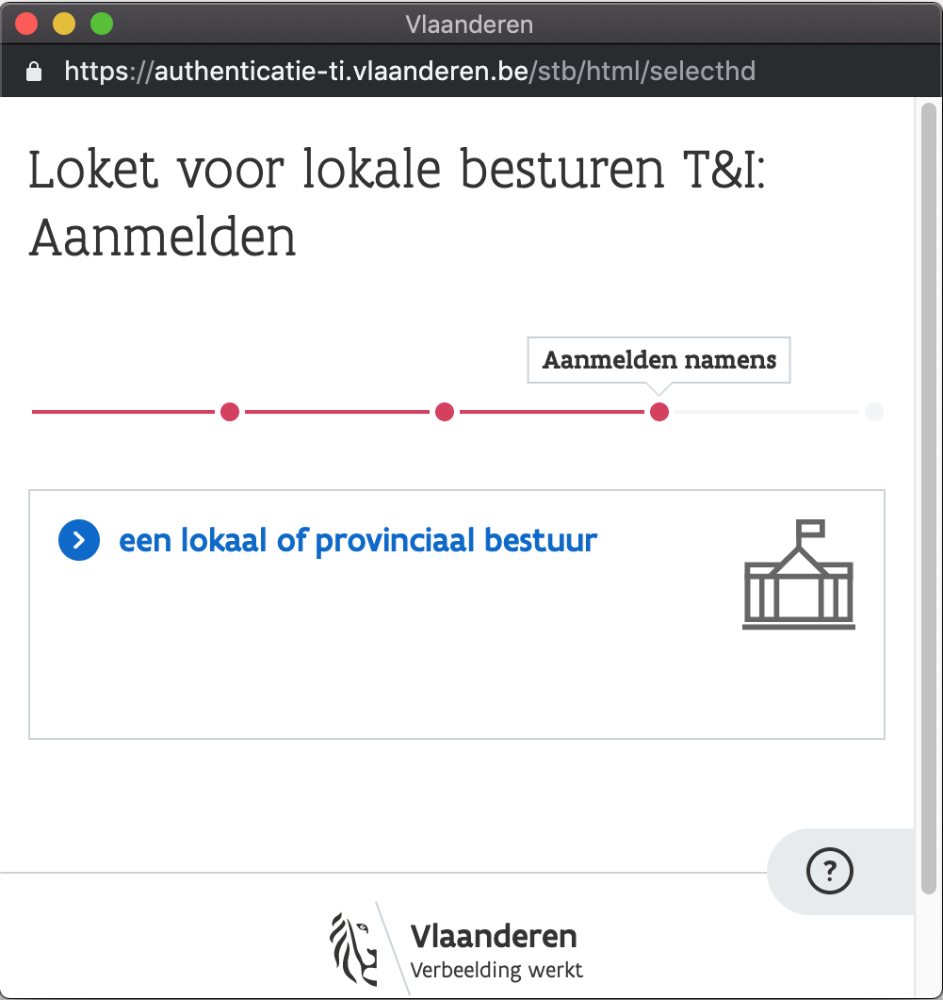
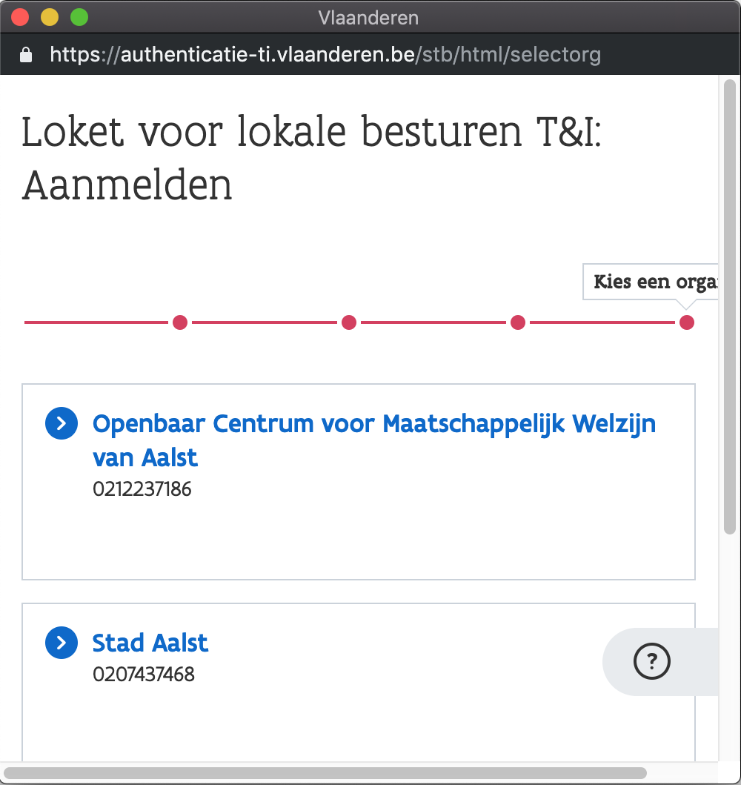

# Signing Off and Switching Administrative Units

## Button – Top Right

You can log off or _switch administrative units_\* by clicking on your administrative unit in the top right corner.

\*_Switching administrative units is only possible for specific applications, and only if you have access to multiple administrative units._

## Switching Administrative Units

When clicking "**Wissel van bestuurseenheid**" you will once more see the pop-up where you first select that you want to apply for a local administration or municipality. **Make sure your browser allows this pop-up as well.** [**See how to allow popups**](signing-in.md#verschijnt-de-pop-up-niet)**.**

Now pick the correct Administrative Unit.

