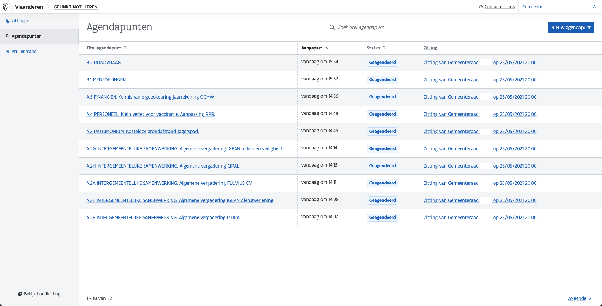
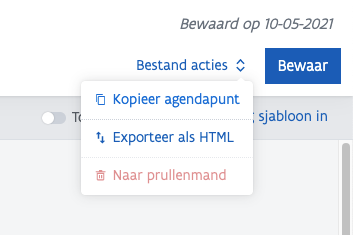
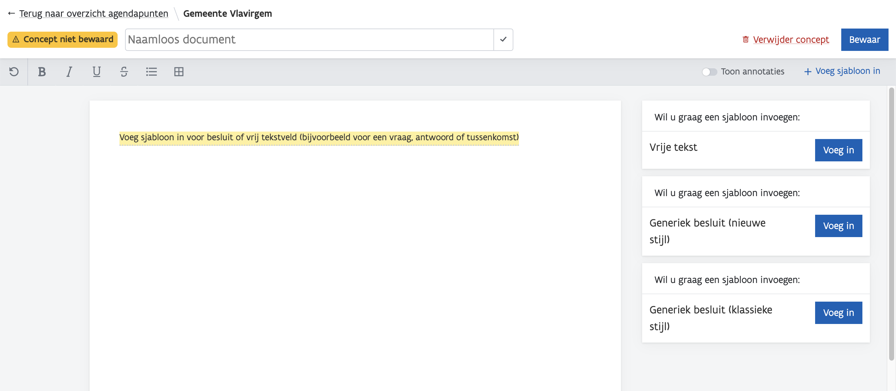

# Phase 1: Prepare Agenda Items

## Context

A local government prepares agenda items - also called dossiers or draft decisions - separately. This is done by the assigned department\(s\) within that local government. It also happens that employees of the secretariat prepare agenda items that do not require specific knowledge, such as the approval of the minutes of the previous meeting.

### Governing Bodies

The agenda items are prepared for various governing bodies. In the application you log in as an employee of a Municipality, Autonomous Municipal Corporation or Province.

* Municipality \(Gemeente\)
  * City Council \(Gemeenteraad\)
  * Municipal College \(CBS – College Burgemeester & Schepenen\)
  * Mayor Autonomous \(Burgemeester\)
  * Autonomous Municipal Corporation \(AGB – Autonoom Gemeentebedrijf\)
* OCMW
  * Special Committee \(Bijzonder comité\)
  * Permanent Office \(Vast Bureau\)
* Province \(Provincie\)
  * Provincial Council \(Provincieraad\)
  * Deputation \(Deputatie\)
  * Autonomous Provincial Administration \(APB – Autonoom Provinciebedrijf\)

## Content Agenda Item 

| Part | Information | Linked information | To be published in |
| :--- | :--- | :--- | :--- |
| **Public title \(in agenda item itself\)** | This title is used when publishing the extracts, minutes and decision lists. | Yes | Uittreksels, notulen, besluitenlijst |
| **Brief public description \(in agenda item itself\)** | Can give more information about the decision. Not every board does this, some copy the title. Used when publishing the excerpts, minutes and decision lists | Yes | Excerpts, minutes, decision list |
| **Governing Body** | What governing body is this about? | No | Minutes |
| **Authorities** | Through the citation plugin, the board enters the legal basis that determines that the body has jurisdiction. | Yes | Minutes, excerpts |
| **Legal context** | Through the citation plugin, the board enters the legal contexts that are related. | Yes | Minutes, excerpts |
| **Rationale** | The board submits the justifications. | No | Minutes, excerpts |
| **Decision** | The decision consists of one or more article\(s\). | Yes | Minutes, excerpts |
| **Articles** | An item consists of an item number and its contents. | Yes | Minutes, excerpts |
| **Article number** | Sequential numbers. | Yes | Minutes, excerpts |
| **Article content** | Content | Yes | Minutes, excerpts |

## **How does it work in Gelinkt Notuleren?**

Our manual gives a clear view on how GN works \[Dutch\].



### Roles

Roles It is important that each department and all secretarial staff have the role `Writer` here. This is set on the [Gebruikersbeheer \(User Management – ACM-IDM\)](https://overheid.vlaanderen.be/ict/ict-diensten/gebruikersbeheer), usually by the IT service of the local government.

* `Reader` can view all agenda items.
* `Writer` can view and edit all agenda items.

### **Location**

In Gelinkt Notuleren, files can be prepared in the **Agendapunten \(Agenda Items\)** tab. It is also possible to create a session directly and add agenda items there - but that is less flexible.

Agenda items that were adjourned can be copied so they do not have to be rebuilt.

### Status

There are 3 statuses 

* `Concept (Draft)` The agenda item is in preparation, but has not yet been linked to a session. The agenda item can be modified at any time.
* `Geagendeerd (Planned)` The item has been included in a preparation for a meeting. The agenda may still change, and the agenda item may be modified.
* `Gepubliceerd (Published)` The event has been linked to a meeting and has been published. The item cannot be modified anymore.

At this stage only `Concept` is applicable.

### Templates \(Sjablonen\)

Whenever you start a new agenda item, you start with one of 2 generic templates: **decisions** \(with an optional vote\) and **free text**. Examples of agenda items:

* Decisions
  * Approving of minutes of the last session
  * Regulations
  * Announcements
* Free text
  * Discussion points
  * Varia

#### Style

We offer 2 styles for decisions:

* **New style**: uses headings to separate **authorities**, **legal context** and **rationale**. Some boards use additional headings, but we make no further distinction here.
* **Classic style**: use "_gelet op \(considering\)_" and "_overwegende dat \(whereas\)_" to separate **legal context** and **rationale**.

