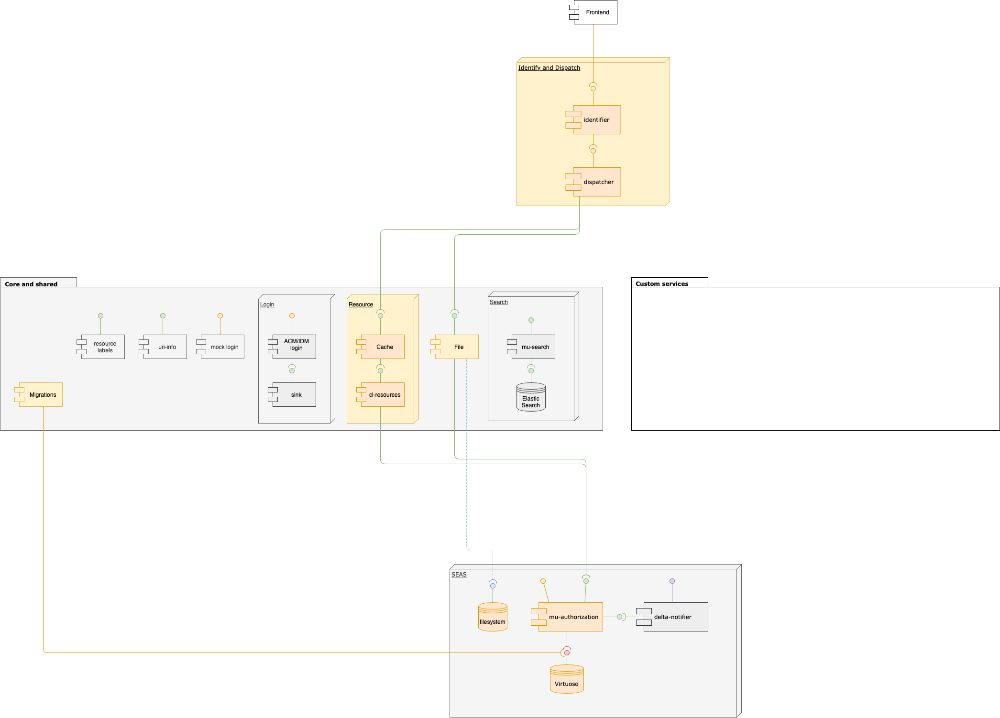

# Register of Measures: Signs & Markings – Register van Maatregelen: Borden & Markeringen

The Agency of Home Affairs works closely together with the department Mobiliteit en Openbare Werken \(MOW – Mobility and Public Works\) and Agentschap Wegen en Verkeer \(AWV – Roads and Traffic Agency\). Together they are creating a register of measures including signs and markings on the road.

## Architecture

## Code

### Front-end



### Application



