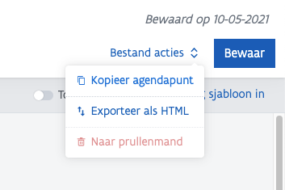
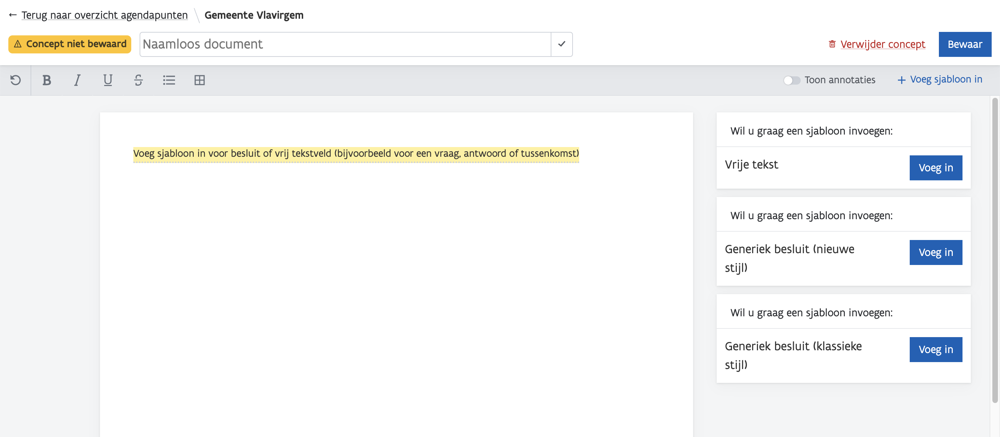

# Gelinkt Notuleren Ondersteunt Gelinkt Publiceren

## Fase 1: Voorbereiden agendapunten

Een lokaal bestuur bereidt agendapunten – ook dossiers of ontwerpbesluiten genoemd – apart voor. Dat gebeurt door de bevoegde dienst\(en\) binnen dat lokaal bestuur. Het gebeurt ook dat medewerkers van de secretarie agendapunten die geen specifieke kennis vereisten voorbereiden, zoals de goedkeuring van de notulen van de vorige zitting.

**\[Hulp nodig: kloppen de mensen die betrokken zijn?\]**

### Bestuursorganen

De agendapunten worden voor verschillende bestuursorganen voorbereid. In de applicatie log je in als medewerker van een Gemeente, OCMW of Provincie**.**

**\[Hulp nodig: district ook? missen er organen of eenheden?\]**

* Gemeente
  * Gemeenteraad
  * College Burgemeester & Schepenen \(CBS\)
  * Burgemeester
  * Autonoom Gemeentebedrijf \(AGB\)
* OCMW
  * Bijzonder comité
  * Vast Bureau
* Provincie
  * Provincieraad
  * Deputatie
  * Autonoom Provinciebedrijf \(APB\)

### **Hoe werkt het in GN?**

#### Rollen

Het is belangrijk dat elke dienst en alle medewerkers van de secretarie hier de rol `Schrijver` hebben. Dit wordt ingesteld op het [Gebruikersbeheer](https://overheid.vlaanderen.be/ict/ict-diensten/gebruikersbeheer) \(ACM-IDM\), meestal door de IT dienst van het lokaal bestuur.

* `Lezer` kan alle agendapunten bekijken.
* `Schrijver` kan alle agendapunten bekijken en bewerken.

**Locatie**

In Gelinkt Notuleren kunnen dossiers voorbereid worden in de tab **Agendapunten**. Het is ook mogelijk om rechtstreeks een zitting aan te maken en daar agendapunten toe te voegen – maar dat is minder flexibel.

Agendapunten die verdaagd werden kunnen gekopieerd worden, zodat ze niet opnieuw opgebouwd moeten worden.

#### Status

Er zijn 3 statussen

* `Concept`  Het agendapunt is in voorbereiding, maar werd nog niet aan een zitting gekoppeld. Het agendapunt kan ten allen tijde aangepast worden.
* `Geagendeerd`  Het agendapunt werd in een voorbereiding van een zitting opgenomen. De agenda kan nog veranderen, en het agendapunt kan nog aangepast worden.
* `Gepubliceerd`  Het agendapunt werd gekoppeld aan een zitting, en deze werd gepubliceerd. Het agendapunt kan niet meer aangepast worden.

In deze fase is enkel `Concept` van toepassing.

### Sjablonen

Wanneer je start met een nieuw agendapunt, start je met een van de 2 generieke sjablonen aan: **besluiten** \(met een stemming\) en **vrije tekst**. Voorbeelden van agendapunten:

* Besluiten
  * Goedkeuren van notulen
  * Reglementen
  * Verordeningen
  * Mededelingen **\[Hulp nodig: of vrije tekst?\]**
* Vrije tekst
  * Discussiepunten
  * Varia

#### Stijl

We bieden 2 stijlen aan voor besluiten:

* **Nieuwe stijl**: gebruikt rubrieken om **bevoegdheden**, **juridische context** en **motivering** te scheiden. Sommige besturen gebruiken nog extra rubrieken, maar wij maken hier geen verder onderscheid. 
* **Klassieke stijl**: gebruiken "_gelet op_" en "_overwegende dat_" om **juridische** **context** en **motivering** te scheiden.

### Inhoud agendapunt

| Onderdeel | Informatie | Gelinkte informatie | Wordt gepubliceerd in |
| :--- | :--- | :--- | :--- |
| **Openbare titel** | Deze titel wordt gebruikt bij het publiceren van het agendapunt. | Ja | Agenda, uittreksels, notulen, besluitenlijst |
| **Korte openbare beschrijving** | Kan meer informatie geven over het besluit. Niet elk bestuur doet dit, sommigen kopiëren de titel. | Ja | Agenda, uittreksels, notulen, besluitenlijst |
| **Bestuursorgaan** | Over welk bestuursorgaan gaat dit? | Nee | Notulen |
| **Bevoegdheid** | Via de citatenplugin geeft het bestuur de rechtsgrond in die bepaalt dat het orgaan bevoegd is. | Ja | Notulen, uittreksels |
| **Juridische context** | Via de citatenplugin geeft het bestuur de juridische contexten in die gerelateerd zijn. | Ja | Notulen, uittreksels |
| **Motivering** | Het bestuur geeft de motiveringen in. | Neen | Notulen, uittreksels |
| **Beslissing** | De beslissing bestaat uit een of meerdere artikel\(s\). | Ja | Notulen, uittreksels |
| **Artikels** | Een artikel bestaat uit een artikelnummer en de inhoud. | Ja | Notulen, uittreksels |
| **Artikel nummer** | Opeenvolgende cijfers. | Ja | Notulen, uittreksels |
| **Artikel inhoud** | Inhoud. | Ja | Notulen, uittreksels |

## Fase 2: Agenda

### Ontwerp agenda

Nadat de agendapunten werden voorbereid worden deze bezorgd aan de secretarie om te agenderen. De agenda wordt over het algemeen voorbereid door een medewerker van de secretarie en/of de algemeen directeur. Daarna wordt deze nagekeken en aangevuld, door de algemeen directeur \(gemeenteraad\), burgemeester of bevoegde schepen \(CBS\) **\[Hulp nodig: wie nog bij welke raad?\]**. 

### Hoe werkt het in GN?

#### Rollen

Via Gelinkt Notuleren kunnen de mensen die geen schrijfrechten nodig hebben, maar wel de agenda nakijken, met de rol `lezer` de geagendeerde agendapunten bekijken.

Voor het agenderen heb je de rol `schrijver` nodig.

#### Locatie

Binnen Gelinkt Notuleren maak je een agenda aan binnen een zitting.

Je vult de informatie in van de zitting die je hebt.

_Openbaarheid_

#### Status

Vanaf het moment dat een agendapunt geagendeerd wordt en gekoppeld aan een zitting, wordt de status `geagendeerd` toegevoegd aan het agendapunt, en kan je het aan geen andere zitting meer toevoegen.

### \(Definitieve\) agenda

Vervolgens wordt de agenda gecommuniceerd naar de raadsleden, en gelinkt gepubliceerd naar de buitenwereld [https://publicatie.gelinkt-notuleren.vlaanderen.be/](https://publicatie.gelinkt-notuleren.vlaanderen.be/) – en op de website van het lokaal bestuur geplaatst.

#### Communicatie naar raadsleden

De agendapunten gecommuniceerd naar de raadsleden. Dit gebeurt over het algemeen door een medewerker van de secretarie of algemeen directeur, via mail of op papier.

Via Gelinkt Notuleren kunnen raadsleden met de rol `lezer` de geagendeerde agendapunten bekijken. Bijkomende documenten kunnen nog per mail bezorgd worden.

_`Aanvullende agenda`_

De raadsleden kunnen nog agendapunten aanbrengen tot X dagen voor de zitting. Deze wordt dan opnieuw intern en extern gecommuniceerd als "aanvullende agenda".

_`Spoedeisende agenda`_

Tot aan de zitting kunnen de raadsleden nog agendapunten aanbrengen. De spoedeisende agenda wordt ook intern en extern gecommuniceerd.

#### Externe communicatie

De agenda wordt gelinkt gepubliceerd via Gelinkt Notuleren \(of een andere leverancier\) en wordt op de website gezet. Wanneer er gepubliceerd wordt via GN, komt deze op de [publicatieomgeving](http://publicatie.gelinkt-notuleren.vlaanderen.be) terecht. Besturen kunnen linken naar deze pagina.

## Fase 3: Zitting

## Fase 4: Publicatie & Melding

## Fase 5: Goedkeuring notulen op volgende zitting

## Terminologieën

### Agenda

**Agendapunt in concept / ontwerpbesluit**:  
Een \(mogelijks nog aan te vullen of aan te passen\) ontwerp voor het besluit dat uit dit agendapunt zou voortkomen.

**Interne agenda**  
Een agenda \(mogelijks nog aan te vullen of aan te passen\), die intern kan worden nagekeken.

**Ontwerpagenda**  
Een agenda \(mogelijks nog aan te vullen of aan te passen\), die voor de zitting gepubliceerd wordt naar zowel de raad als naar de burger.

**Aanvullende agenda**  
De ontwerpagenda kan na publicatie nog herzien worden. Na herziening wordt deze opnieuw gepubliceerd als aanvullende agenda. Ook deze kan nog aangevuld worden.

**Spoedeisende agenda**  
Agenda met punten aangebracht door de raad tot net voor de zitting.

