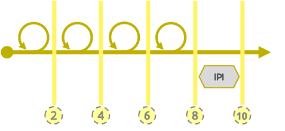

# Agile product development at ABB

The way we develop our products and collaborate together is based on the [Scaled Agile Framework \(SAFe\)](https://www.scaledagileframework.com), be it with some adaptations to better match our ABB Digiteam way of doing things and the number of people in our team.


This page is under construction. Do you read something weird? Please get in touch! [david.suijkerbuijk@vlaanderen.be](mailto:david.suijkerbuijk@vlaanderen.be)


## Agile product development! Why?

Big challenges are broken down in smaller, manageable parts. In doing so a constant flow emerges and as a team we can see our solutions grow.

* Transparent overview on the work done and to be done
* Divide our work in manageable parts
* Plan enough and plan in a flexible way
* Getting the responsabilities in the right place

## We try to keep a constant pace on three levels:

* Our Rolling Wave based[ **roadmap**](./#roadmap) looks ahead for at least one year.
* The ****[**Groeispurts**](./#groeispurt) of ten weeks systematically end with a [**Centrale Planningsdag**](./#centrale-planningsdag).
* Every Groeispurt consists out of four [**sprints**](./#ontwikkelsprint) ****and one[ **IPI**](./#innovatie-en-planning-iteratie-ipi).


The release of product features that have been developed and tested is not necessarily linked to the pace we follow at our three levels. 


### Roadmap

@Heidi Vul jij dit aan met een beschrijving? Afbeelding en link naar de roadmap?

### Spurten and Sprinten?

#### Groeispurt

A groeispurt has a duration of ten weeks. It contains four development sprints and one Innovation and Planning Iteration. During the last week of a groeispurt a Centrale Planningsdag \(CPD\) is held where the goals for the next groeispurt are being determined and feature planning for the products are made and agreed upon. 

Because we all work in periods of ten weeks, we keep sufficient focus on setting the necessary steps in the development of our products and at the same time we remain agile to cope with ever changing contexts. In doing so the scrum teams have a clear focus on the spurt and sprint goals for the upcoming ten weeks, leaving room for focus shift in the next Groeispurt in case priorities within ABB are all of a sudden changing. 

#### \(Development\) Sprint

A sprint is well defined period of two weeks in which the product team starts working together to achieve a clear sprint goal. Sprints are following each other immediately and have fixed elements/ rituals: 

* Sprint Planning
* Standup
* Sprint demo 
* Sprint Retrospective
* Backlog refinement

#### Innovatie en Planning Iteratie \(IPI\)

Next to the development of features, which is a core focus for every product scrum team, there is a need as well for other activities that make product teams grow. For that reason every last two weeks of a Groeispurt are atypical because it explicitly makes room for … 

* Innovation and experiments
* Training
* Planning activities for the next Groeispurt

When? The Innovation and Planning \(IPI\) iteration is organized at the end of a Groeispurt.

#### Common structure for organizing the IPI at Digiteam ABB

To organize the activities that are typically done in the IPI we made a calendar and plotted the must-have activities on that calendar. In plotting the activities we took into account some preferences of the team regarding meeting days and tried to group the innovation activities as one block to prevent focus drift between innovation and planning meetings. This calendar is being used as well to put placeholders for certain IPI activities in the personal calendars of people who need to attend. 

Typical IPI-activities are: testing new technologies, sharing newly developped functionalities with other teams, knowledge transfer, scoping sessions & brainstorms, retrospectives,  …

Our IPI calendar at ABB currently looks like:

_**WEEK 1 IPI: FOCUS on sprintplanning IPI - Innovation - Inspect and adapt**_

| Day/Part | Monday | Tuesday | Wednesday | Thursday | Friday |
| :--- | :--- | :--- | :--- | :--- | :--- |
| AM | Sprintplanning IPI | Innovation | Innovation | Innovation | Inspect and Adapt |
| AM | \(Retrospectieve\) | Capacity check DEV + Design |  |  |  |
| PM | Innovation | Innovation | Innovation | Innovation | Inspect and Adapt |
| PM | \(Retrospective\) |  |  |  |  |

_**WEEK 2 IPI: Focus on Groeispurtplanning \(CPD and prep\) - Retrospective and Sprintdemo IPI**_

| Dag/Deel | Maandag | Dinsdag | Woensdag | Donderdag | Vrijdag |
| :--- | :--- | :--- | :--- | :--- | :--- |
| AM | Impact Mapping | Impact Mapping | Story Mapping | CPD | Retrospective |
| AM | Story Mapping | Story Mapping | Impact Mapping |  |  |
| PM | Impact Mapping | Impact Mapping | Capacity Check PM's ifv planning | CPD | Sprintdemo IPI |
| PM | Story Mapping | Story Mapping |  |  | Prepare backlog for sprint 1 |


The capacity of an IPI can not be used to reach the Groeispurt targets and thus may not be considered as an extra sprint to build product features. The sprint should be used to give the teams time to work on innovation for future purposes, to document what was built, to prepare and plan the next Groeispurt and to look back on how the team performed in the Groeispurt that is approaching its end.


### Centrale Planningsdag - CPD

The central planningsday is a crucial moment to look back at the Groeispurt that is ending and to look ahead and plan for the next Groeispurt. Therefore it is situated inbetween two Groeispurts. 

It provides time for all actors involved in our agile product development to … 

* show wat has been realised in a series of plenary product demo's.
* plan the next Groeispurt using the preparation that has been made in the days proceeding the CPD. Ultimately epics \(product features\) will be planned for execution. Their execution will contribute to the  [oplossingen](../levensloop-van-een-oplossing.md#oplossingen-hoe) they are linked to.
* align with other product teams to realise shared solutions. 

When? De Centrale Planningsdag \(CPD\) is organised every second Thursday of the IPI.

### Typical IPI-activities explained

#### Retrospective

The sprint retrospective is a recurring meeting held at the end of a Groeispurt and is used to discuss what went well during the previous Groeispurt cycle and what can be improved in the next Groeispurt. The Agile sprint retrospective is an essential part of the Agile Scrum way of working. At Digiteam ABB we agreed to do a retrospective at the end of four sprints and not at the end of every sprint. Issues that arise during the sprint and that have a \(severe\) impact on the collaboration of the product teams or on their efficiency are of course dealt with immediately by the team and the scrum master\(s\) and do not wait until the retrospective at the end of the Groeispurt. Consequently and ad hoc retrospective is possible.

#### Inspect and Adapt

Currently, the Inspect and Adapt workshop is a new element in the scaled agile method of building and delivering products at Digiteam ABB. Therefore it is not applied to the fullest extend it is being described by[ the Scaled Agile Framework](https://www.scaledagileframework.com/inspect-and-adapt/). 

According to the Scaled Agile Framework, the Inspect and Adapt event typically consists of 3 parts:  
1. PI System Demo   
2. Quantitative and qualitative measurement  
3. Retrospective and problem-solving workshop

Currently at Digiteam the Inspect and Adapt - where organized - focusses on a retrospective and problem solving/ inventory workshop with the product team to determine what needs to be further taken up in an upcoming Groeispurt.  

#### Capacity check

The capacity check\(s\) performed during the IPI are a moment to gather information on the availability of team members during the upcoming Groeispurt. The check is necessary to prevent team members being "overplannend" in one or more product teams leading to frustration and ultimately sprint targets not being reached. A capacity check with the developers, designers and analysts is followed by a capacity check with Product Managers and Product Owners on the day before the CPD. The outcome of the check is a view on the available mandays per team member per sprint. This info is then used to plan work during the planning session of the CPD.

#### Impact Mapping

The technique of Impact mapping helps the producteams at Digiteam ABB and their stakeholders not only to visualise the product roadmaps but also to explain how deliverables connect to user needs, and communicate how user outcomes relate to higher level solutions and value streams.

For our impact mappings we use a technique of impact maps, described by [Neuri Consulting LLP](https://www.impactmapping.org). In making and updating the impact maps of a product the teams think about behaviour changes that would have a big impact on the users of the product. Next, we write them down in the impact map and group the impacts by actors, personas or user categories using branches. Next, per branch \(impact per group\) we add deliverables that could support those behaviour changes and target dates we aim for to realize the impact. Subsequently we include the organizational goals supported by those impacts in the mindmap. 

#### Story Mapping

A user story map helps you arrange user stories into a useful model for understanding the functionality of a system, identifying holes and omissions in your backlog, and effectively plan  releases that deliver the best possible value to users and business at the time through releases.

User Story Map is becoming a popular user story management technique through the efforts of [**Jeff Patton**](http://jpattonassociates.com/blog/) and others. The user story tool allows you to establish multiple levels and dimensions for a product backlog through the breakdown of user needs as user activities, user tasks, epics and user stories. Typically, an agile development team makes use of story map in collaborative meetings in identifying the desired results the end users want to achieve.

