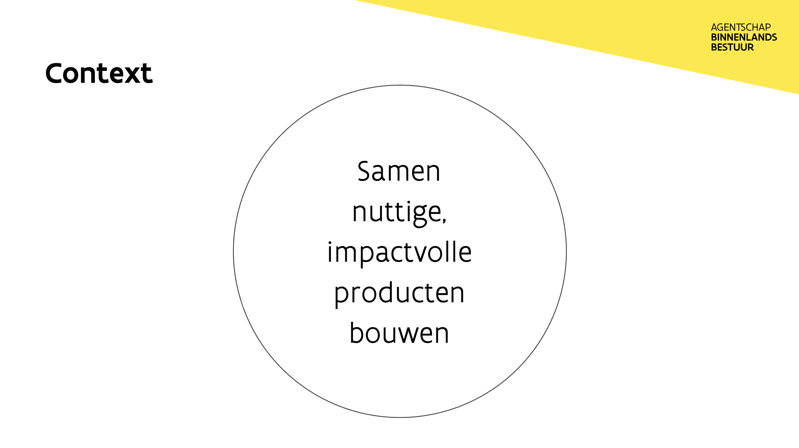
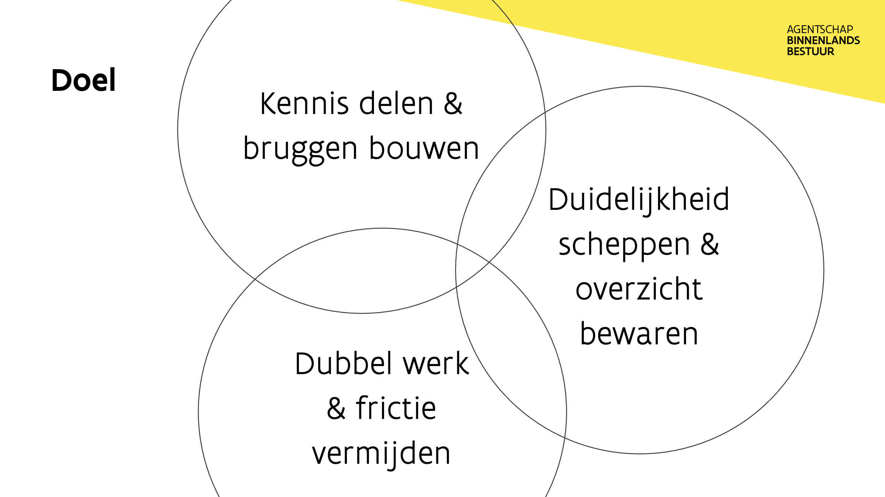
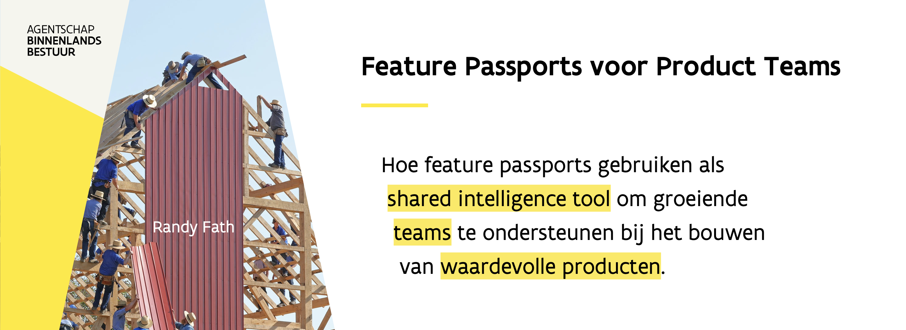
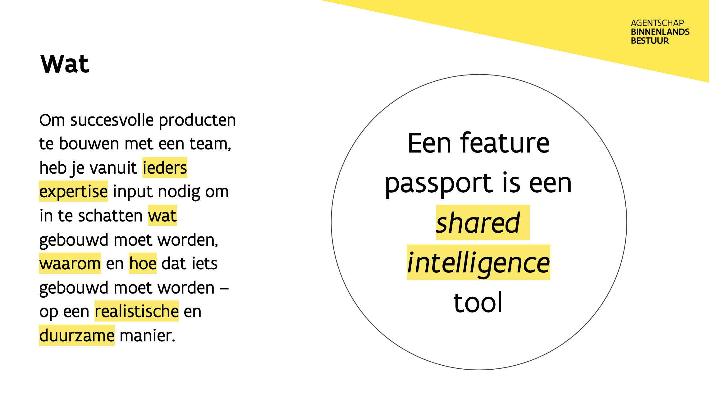

# Feature Passports

Om succesvolle producten te bouwen met een team, heb je vanuit ieders expertise input nodig om in te schatten wat gebouwd moet worden, waarom en hoe dat iets gebouwd moet worden – op een realistische en duurzame manier.

Feature passports zijn een manier voor ons om dat te doen.

## Functie van Feature Passports

### Context & Doel

### Voor product teams

Een feature passport bestaat om te communiceren onder teamleden over het gedeelde begrip en status van een feature die geïmplementeerd wordt, geïmplementeerd zal worden of verbeterd wordt.

### Een "Shared Intelligence" tool

Gebruik feature passports om:

1. Kennis die in mensen hun hoofden verscholen zit neer te schrijven;
2. discussies op te starten en feedback te geven;
3. als "bron van waarheid" voor uitvoering \(maar hou punt 2 in gedachten, dit staat niet muurvast\);
4. nieuwe teamleden en teamleden up-to-date te brengen.

Om ervoor te zorgen dat iedereen weet wat we gaan doen, wat ze gaan bouwen en waarom, en wat de status is.

## Sjabloon




Feature passports bestaan om een documentatiecultuur te ondersteunen, dat aangemoedigd wordt wanneer we open source applicaties maken – zodat iedereen kan bijdragen wanneer ze kunnen en willen.


Onderzoek naar feature passports: 

[https://docs.google.com/document/d/1dlmUfAjWKNk3aZLs-m7P5bVMLUgE0FSW8B3atvqQtV4/edit?usp=sharing](https://docs.google.com/document/d/1dlmUfAjWKNk3aZLs-m7P5bVMLUgE0FSW8B3atvqQtV4/edit?usp=sharing)

